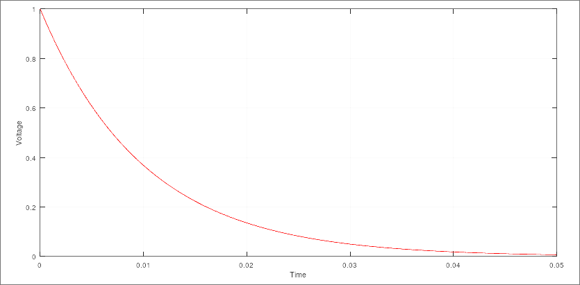
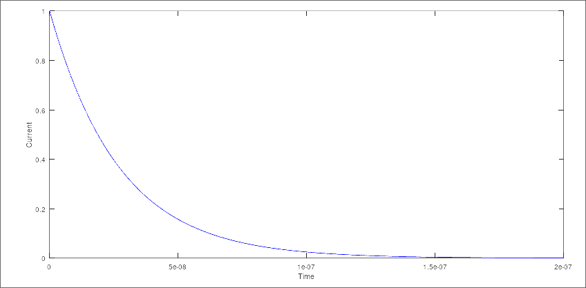

# Final Exam
***ECE 111***

## Question 1

```matlab
% Question 1
T = [0:1e-4:50e-3];
Req = (2e3 * 1e3) / (2e3 + 1e3);
Vo = 1;
C = 15e-6;

V = Vo .* exp(-T ./ (Req * C));

plot(T, V, 'r');
xlabel("Time");
ylabel("Voltage");
grid on;
```



## Question 2

```matlab
% Question 2
T = [0:1e-10:200e-9];
Req = (2e3 * 1e3) / (2e3 + 1e3);
Io = 1;
L = 18e-6;

I = Io .* exp(-((Req .* T) ./ L));

plot(T, I, 'b');
xlabel("Time");
ylabel("Current");
grid on;
```


