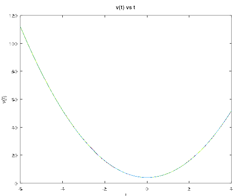
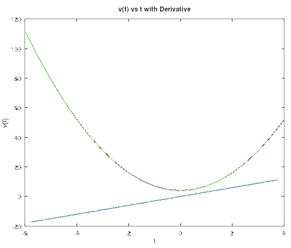

1. 
a. 
```matlab
% Question 1a
T = [-6:0.5:4];
V = 3 .* T .* T + 4;

plot(T, V);

xlabel("t");
ylabel("v(t)");
title("v(t) vs t");
grid on;
```




b.
```matlab
% Question 1b
dT = [-5.75:0.5:3.75];
dV = diff(V);

plot(dT, dV);
```



c.

```matlab
% Question 1c
iV = trapz(V);

disp('Integral of v(t) from t = -6 to t = 4 using the trapz function');
disp(iV);

%{
Integral of v(t) from t = -6 to t = 4 using the trapz function
642.50
%}
```

Output: ```
```
Integral of v(t) from t = -6 to t = 4 using the trapz function
642.50
````
