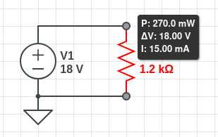
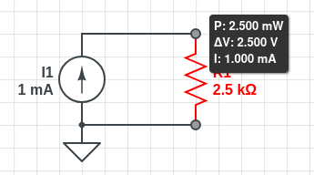

1. 
   - 0.1A * 5V = 0.5W (Absorbed)
   - -0.4A * 12V = -4.8W (Supplied)
   - 12mA * -12.5mV = -150uW (Supplied)
   - 2mA * -15mV = -75uW (Supplied)

2. 
   - P1 = 20mA * 1mV = 20uW (cktt2 absorbs)
   - P1 = 10mA * 50mV = 500uW (ckt2 absorbs)
   - P1 = 22mA * -25mV = -550uW (ckt2 supplies)

3. 
   - P2 = 1mA * 200mV = 200uW (ckt2 absorbs)
   - P2 = 10mW (same voltage and shared current) (ck2 absorbs)
   - P2 = 175mW (ck2 absorbs)

4. 
   - P3 = 3mA * 5mV = 15uW (Absorbed)
   - P3 = 0mA * 12mV = 0W (Neither)

5. 
   - P4 = 1mA * 18mV = 18uW

6. 
   - V=IR => 220mV=38mA(R) => 220mV/38mA = R = 5.789 Ω
   - V=IR => 10mV=20KΩ(I) => 10mV/20kΩ = I = 500nA
   - IR=V => 120mA(12kΩ) = V = 1.44kV

7. 
   - V=IR => 3mV=15mA(R) => 3mV/15mA = R = 200mΩ
   - IR=V => 18mA(25Ω) = V = 45mV
   - V=IR => 18mV=2.1kΩ(I) => 18mV/2.1kΩ = I = 8.57uA

8. 
   - 
   -