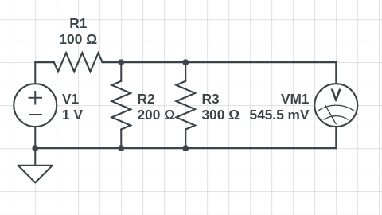
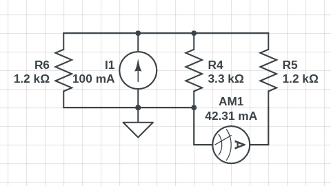

### 1.
a. 
- Is = I1 + I2 + I3
- 5mA = 1mA + 1.5mA + I3
- **I3** = 5mA - 1mA - 1.5mA = **2.5mA**

b.
- Is = I1 + I2 + I3
- -5mA = -3mA + I2 - 1mA
- **I2** = -5mA + 3mA + 1mA = **-1mA**

c.
- Is = I1 + I2 + I3
- P1 = V * I1
- 3mW = V * 1mA
- V = 3V
- I = V/R
- I2 = 3V / 1.2kΩ = 2.5mA
- I3 = 3V / 1.5kΩ = 2mA
- **Is** = 1mA + 2.5ma + 2mA = **5.5mA**

### 2.
a.
- **V2** = Vs - V1 = 1.5V - 0.3V = **1.2V**

b.
- **V3** = Vs = **18**

c.
- Vs = V3
- V1 = Vs - V2
- **V1** = 525mV - 75mV = **450mV**

### 3.
a.
- **I1** = Is = **10mA**
- Is = -(I2 + I3)
- I3 + I2 + Is = 0
- **I3** = -(Is + I2) =  -(10mA - 5mA) = **-5mA**

b.
- **I2** = -(Is + I3) = -(100mA - 25mA) = **-75mA**

c.
- P2 = V2 * I2
- V2 = P2 / I2 = 10mW / -10mA = -1V
- I3 = V3 / R3 = -1V / 1kΩ = -1mA
- **Is** = -I3 = **1mA**

### 4.
a.
- **V2** = Vs - V1 = 650mV - 250mV = **400mV**

b.
- **V3** = Vs - V1 = 500mV - 25mV = **475mV**

c.
- **V4** = **0** (Nice try)

### 5.
a.

b.
