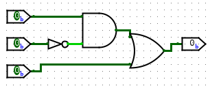
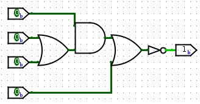

# Class 2

F = AB'+C

F = (A(B+C)+D)'

---

F = AB'+C

G = (A+C)(B'+C)

Does F == G?

Testing all combinations - Truth Table Method

|A|B|C|F|G|
|-|-|-|-|-|
|0|0|0|0|0|
|0|0|1|1|1|
|0|1|0|0|0|
|0|1|1|1|1|
|1|0|0|1|1|
|1|0|1|1|1|
|1|1|0|0|0|
|1|1|1|1|1|

They are the same!

---

F = (X+Y)'

G = X' * Y'

Does F == G?

| X | Y | X+Y | F | X' | Y' | G |
| ---- | ---- | ---- | ---- | ---- | ---- | ---- |
| 0 | 0 | 0 | 1 | 1 | 1 | 1 |
| 0 | 1 | 1 | 0 | 1 | 0 | 0 |
| 1 | 0 | 1 | 0 | 0 | 1 | 0 |
| 1 | 1 | 1 | 0 | 0 | 0 | 0 |

They are the same!

---

### deMorgan's Theorem

(X + Y)' = X' * Y'
(X * Y)' = X' + Y'

---

Can you apply deMorgan's Theorem to ( (A' + B) * C' )'

(X * Y)' where X = (A' + B) and Y = C'
(A' + B)' + C
AB' + C

Another problem

( (A * B' + C) * D' + E )' -> (((A' + B) * C') + D) * E'
