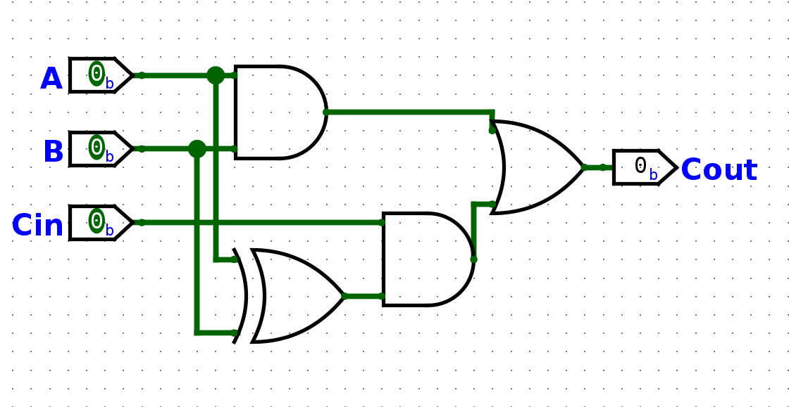
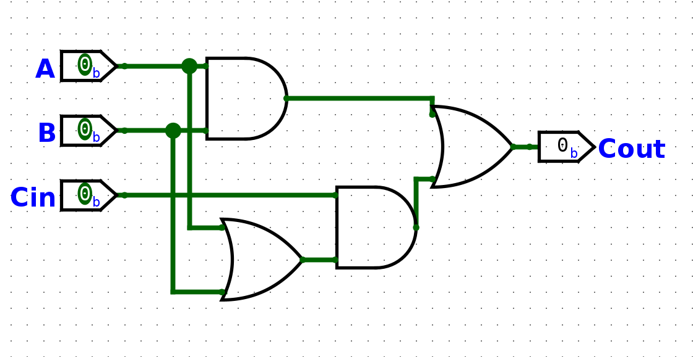
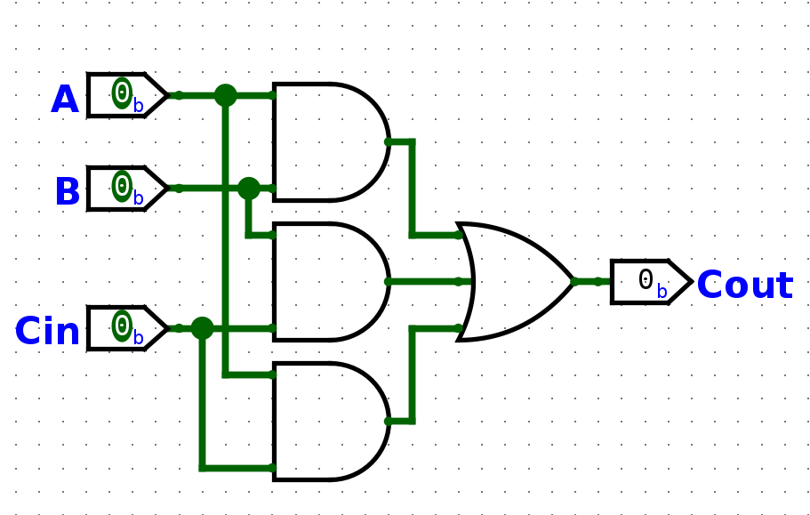
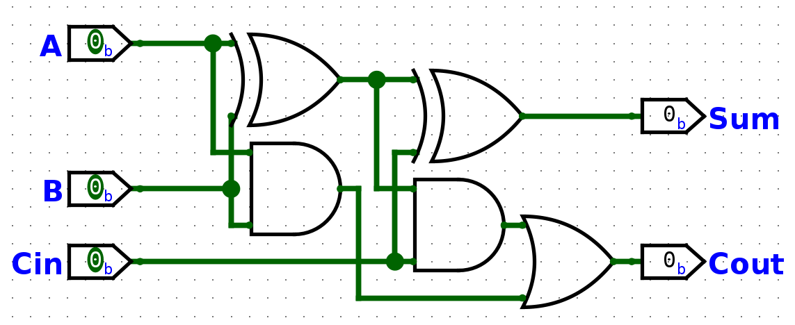

# Class 10

#### Adders!!!!

Full Adder

S = A'B'Cin + A'BCin' + AB'Cin' + ABCin
S = A'(B ⊕ Cin) + A(B ⊕ Cin)'
S = A ⊕ B ⊕ Cin

Cout = A'BCin + AB'Cin + ABCin' + ABCin
Cout = Cin(A'B + AB') + AB(Cin' + Cin)
Cout = Cin(A ⊕ B) + AB
**Other forms**
Cout = AB + Cin(A + B)
Cout = AB + BCin + ACin

#### Form 1

#### Form 2

#### Form 3

Would prefer **From 3** because it will be be fastest due to **Critical Path** (the longest path it takes for something to get the result)

### Design Problem 1

How do design a full adder using half adders

### Design Problem 2

A: A3 A2 A1 A0
B: B3 B2 B1 B0

4-bit Adder

A3     A2     A1      A0
B3     B2     B1      B0
FA <- FA <- FA <- HA
S3     S2     S1      S0
Cout

4-bit RCA (Ripple Carry Adder)
CLA (Carry Lookahead Adder)

### Design Problem 3

Find the 2's Complement of a 4bit number
