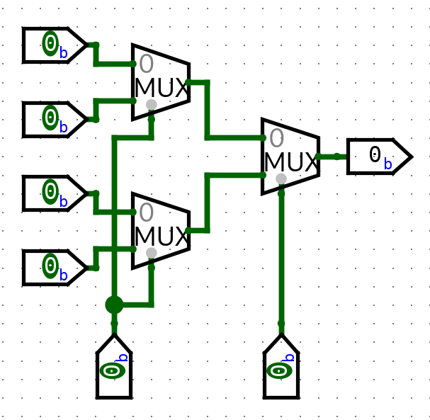

# Class 15

## Universal Gates

2 Universal Gates
- NAND
- NOR

You can use just NAND gates or just NOR gates to make every other gate

## NAND Examples
#### Example: Create inverter with a NAND gate

#### Example: Create AND using NANDs

#### Example: Create OR using NANDS

## NOR Examples

#### Example: NOT using NOR

#### Example: OR using NOR

#### Example: AND using NOR

## Multiplexers (Multiplexor) : Data Selector

Uses an input selector to choose which data goes through

2:1 MUX

When 
    `S = 0, F <= A`
    `S = 1, F <= B`

You can also have 4:1 MUX

Symbol is the same but has 2 selector bits

When
    `S = 00, F <= A`
    `S = 01, F <= B`
    `S = 10, F <= C`
    `S = 11, F <= D`

You can also have 
- 8:1 MUX with 3 select lines
- 16:1 MUX with 4 select lines
- 32:1 MUX with 5 select lines

**MUXes are universal gates**

## MUX Examples
#### Example: Inverter using 2:1 MUX

#### Example: AND using 2:1 MUX

#### Example: OR using 2:1 MUX

#### Example: XOR using 2:1 MUX

#### Example: NAND using 2:1 MUX

#### Example: NOR using 2:1 MUX

#### Design Problem: 4:1 MUX using 2:1 MUX's

#### Design Problem
Program the following 8:1 MUX to implement 
F = ABC + A'CD + BC'D' + AB'D
Inputs: A, A', B, B', C, C', D, D', `0`, `1`

What should be the values for the pins?

###### Step 1: Draw the truth table

| A   | B   | C   | D   | F   |
| --- | --- | --- | --- | --- |
| 0   | 0   | 0   | 0   | 0   |
| 0   | 0   | 0   | 1   | 0   |
| 0   | 0   | 1   | 0   | 0   |
| 0   | 0   | 1   | 1   | 1   |
| 0   | 1   | 0   | 0   | 1   |
| 0   | 1   | 0   | 1   | 0   |
| 0   | 1   | 1   | 0   | 0   |
| 0   | 1   | 1   | 1   | 1   |
| 1   | 0   | 0   | 0   | 0   |
| 1   | 0   | 0   | 1   | 1   |
| 1   | 0   | 1   | 0   | 0   |
| 1   | 0   | 1   | 1   | 1   |
| 1   | 1   | 0   | 0   | 1   |
| 1   | 1   | 0   | 1   | 0   |
| 1   | 1   | 1   | 0   | 1   |
| 1   | 1   | 1   | 1   | 1   |
Next, figure out select lines
For simplicity, make select lines A,B,C

---

## Homework, XOR using NAND (4) and NOR (5)

---
#### NANDs

#### NORs
F = A'B + AB'
F = ((A'B)'(AB')')'
F = ((A + B')(A' + B))'
