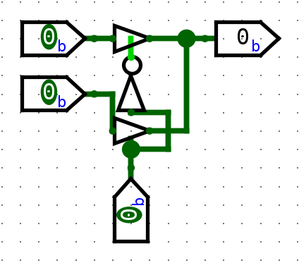

# Class 16

## Tri State Buffers (Three State Buffers)

Regular buffer

| A   | F   |
| --- | --- |
| 0   | 0   |
| 1   | 1   |

Tri State Buffer
Z = High Impedance (Open circuit)

- Active high TSB

| Enable | A   | F   |
| ------ | --- | --- |
| 0      | 0   | Z   |
| 0      | 1   | Z   |
| 1      | 0   | 0   |
| 1      | 1   | 1   |

- Active high inverted TSB

| Enable | A   | F   |
| ------ | --- | --- |
| 0      | 0   | Z   |
| 0      | 1   | Z   |
| 1      | 0   | 1   |
| 1      | 1   | 0   |

- Active low TSB

| Enable | A   | F   |
| ------ | --- | --- |
| 0      | 0   | 0   |
| 0      | 1   | 1   |
| 1      | 0   | Z   |
| 1      | 1   | Z   |

- Active low inverted TSB

| Enable | A   | F   |
| ------ | --- | --- |
| 0      | 0   | 1   |
| 0      | 1   | 0   |
| 1      | 0   | Z   |
| 1      | 1   | Z   |

#### Design Problem 2:1 MUX using TSB

Only requires 4 transistors

Using logic gates, a 2:1 MUX is 14 transistors

### Transceiver: Transmitter + Receiver
Can use TSBs in transceiver designs

## Decoders

1. Takes n inputs and produces 2^n outputs
2. Only one will be active at any given time (only one is assserted)

2:4 Decoder
3:8
4:16
...

| A   | B   | Y3    | Y2    | Y1    | Y0    |
| --- | --- | ----- | ----- | ----- | ----- |
| 0   | 0   | 0     | 0     | 0     | **1** |
| 0   | 1   | 0     | 0     | **1** | 0     |
| 1   | 0   | 0     | **1** | 0     | 0     |
| 1   | 1   | **1** | 0     | 0     | 0     |

Known as One-Hot Encoding

Y0 = A'B' -> m0
Y1 = A'B -> m1
Y2 = AB' -> m2
Y3 = AB -> m3

Decoder produces minterms

Internal Workings

#### Design Problem: Half-Adder using 2:4 Decoder and Additional Logic

Steps to solve:
1. Draw truth table for HA

| A   | B   | Sum | Cout |
| --- | --- | --- | ---- |
| 0   | 0   | 0   | 0    |
| 0   | 1   | 1   | 0    |
| 1   | 0   | 1   | 0    |
| 1   | 1   | 0   | 1    |
Sum = m1 + m2
Cout = m3

2. Use decoder to realize equations

### 3:8 Decoder

| A   | B   | D   | Y7  | Y6  | Y5  | Y4  | Y3  | Y2  | Y1  | Y0  |
| --- | --- | --- | --- | --- | --- | --- | --- | --- | --- | --- |
| 0   | 0   | 0   |     |     |     |     |     |     |     | **1**   |
| 0   | 0   | 1   |     |     |     |     |     |     | **1**   |     |
| 0   | 1   | 0   |     |     |     |     |     | **1**   |     |     |
| 0   | 1   | 1   |     |     |     |     | **1**   |     |     |     |
| 1   | 0   | 0   |     |     |     | **1**   |     |     |     |     |
| 1   | 0   | 1   |     |     | **1**   |     |     |     |     |     |
| 1   | 1   | 0   |     | **1**   |     |     |     |     |     |     |
| 1   | 1   | 1   | **1**   |     |     |     |     |     |     |     |

#### Homework Problem: Design a full adder using 3:8 decoder + additional logic

Solution

