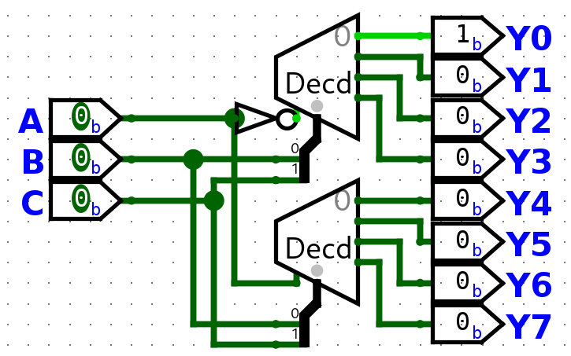

# Class 17

## Decoders with Enable
2:4 Decoder truth table with Enable

| E   | A   | B   | Y3  | Y2  | Y1  | Y0  |
| --- | --- | --- | --- | --- | --- | --- |
| 0   | X   | X   | 0   | 0   | 0   | 0   |
| 1   | 0   | 0   |     |     |     | 1   |
| 1   | 0   | 1   |     |     | 1   |     |
| 1   | 1   | 0   |     | 1   |     |     |
| 1   | 1   | 1   | 1   |     |     |     |

---
3:8 Decoder

| E   | A   | B   | D   | Y7    | Y6    | Y5    | Y4    | Y3    | Y2    | Y1    | Y0    |
| --- | --- | --- | --- | ----- | ----- | ----- | ----- | ----- | ----- | ----- | ----- |
| 0   | X   | X   | X   | 0     | 0     | 0     | 0     | 0     | 0     | 0     | 0     |
| 1   | 0   | 0   | 0   |       |       |       |       |       |       |       | **1** |
| 1   | 0   | 0   | 1   |       |       |       |       |       |       | **1** |       |
| 1   | 0   | 1   | 0   |       |       |       |       |       | **1** |       |       |
| 1   | 0   | 1   | 1   |       |       |       |       | **1** |       |       |       |
| 1   | 1   | 0   | 0   |       |       |       | **1** |       |       |       |       |
| 1   | 1   | 0   | 1   |       |       | **1** |       |       |       |       |       |
| 1   | 1   | 1   | 0   |       | **1** |       |       |       |       |       |       |
| 1   | 1   | 1   | 1   | **1** |       |       |       |       |       |       |       |

### Design Problem: 
3:8 Decoder using 2 2:4 Decoders (with enable bits) + additional logic
#### Solution

## Encoders
Opposite of the decoder
- 2^n inputs, 2 outputs (4:2, 8:3, 16:4)
- Only one of the inputs should be enabled at any given time

4:2

| Y3  | Y2  | Y1  | Y0  | A   | B   |
| --- | --- | --- | --- | --- | --- |
| 0   | 0   | 0   | 1   | 0   | 0   |
| 0   | 0   | 1   | 0   | 0   | 1   |
| 0   | 1   | 0   | 0   | 1   | 0   |
| 1   | 0   | 0   | 0   | 1   | 1   |

Problems with encoders
- What if more than one inputs are 1?
- What is no inputs are 1?

How do we solve these issues?
**Priority Encoder**

| Y3  | Y2  | Y1  | Y0  | A   | B   | Valid |
| --- | --- | --- | --- | --- | --- | ----- |
| 0   | 0   | 0   | 1   | 0   | 0   | 1     |
| 0   | 0   | 1   | X   | 0   | 1   | 1     |
| 0   | 1   | X   | X   | 1   | 0   | 1     |
| 1   | X   | X   | X   | 1   | 1   | 1     |
| 0   | 0   | 0   | 0   | X   | X   | 0     |

#### Use case

Take 4 devices, with Device A as the most important and Device D is the least that are trying to access a mico-processor. If Device B is trying to access the micro-processor and Device A is trying to access it, Device A will get priority. Examples of this use case are **pacemakers**.

---
## End of Material for Exam 2
---
