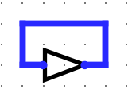
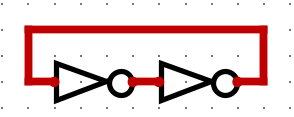
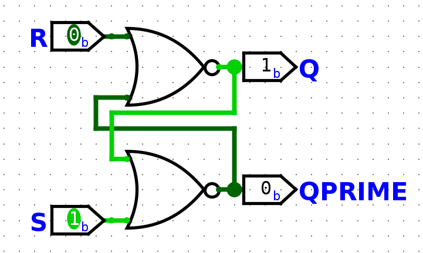
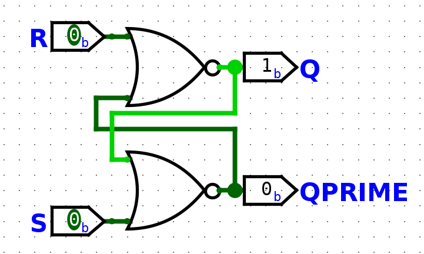
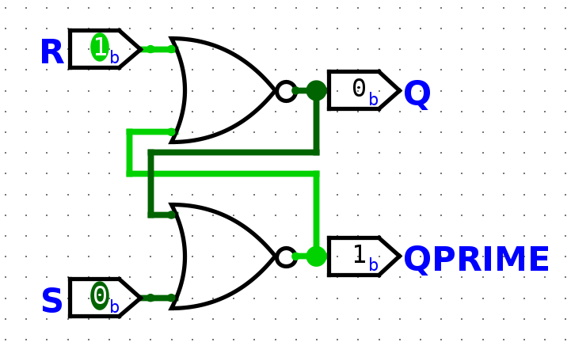
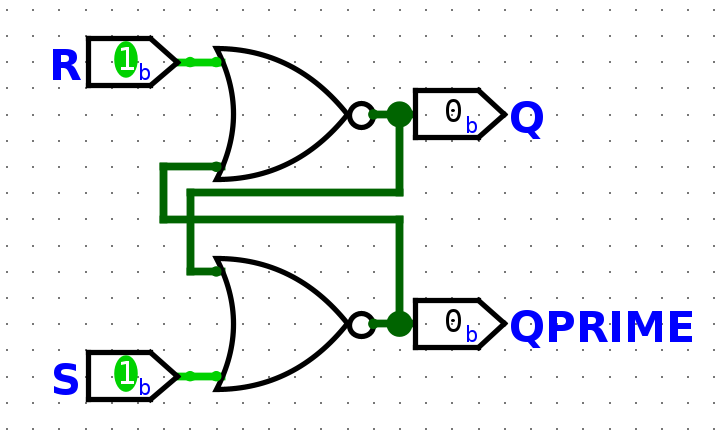

# Class 18

## How to make looped testbench
A circuit with vec4 input and a vec6 output example testbench

```vhdl
-- testbench.vhd
library ieee;
use ieee.std_logic_1164.all;
use ieee.numeric_std.all;

entity testbench is
end;

architecture arch of testbench is
component my_ckt is
    port(A in  std_logic_vector(3 downto 0);
         F out std_logic_vector(5 downto 0));
end component;
signal A: std_logic_vector(3 downto 0);
signal F: std_logic_vector(5 downto 0);
begin 
    DUT: my_ckt port map (A, F);
    inputs: process
    begin
        for i in 0 to 15 loop
            A <= std_logic_vector(to_unsigned(i, A'length));
            wait for 10 ns;
        end loop;
        wait;
    end process;
end architecture;
```

## Sequential Circuits
Until now, all circuits have been inputs -> outputs

In sequential circuits, you will have feedback. 

You will have inputs, outputs, and feedback (memory)

```
i -> +---+ -> o
     |ckt|
+ -> +---+ -> |memory| -+
|                       |
+-----------------------+
```

Output depends on inputs and past inputs.

Most common elements to define memory blocks:
- Latches
- Flip-Flops
They have at least one input and two outputs

Outputs are `Q` and `Q'`

Basis of memory is this feedback loop


Typically a buffer is created using two not gates


Issue with this circuit is that it is permanent (can't be changed)
Solution is **SR Latch** which can be realized with 2 NOR gates

### 1. Power Up State

### 2. S = 1, R = 0, Q = 0, Q' = 1 -> Q = 1, Q' = 0 *(Sets Memory)*


### 3. S = 0, R = 0, Q = 1, Q' = 0 -> Q = 1, Q' = 0 *(Hold State)*


### 4. S = 0, R = 1, Q = 1, Q' = 0 -> Q = 0, Q' = 1 *(Resets Memory)*


### 5. S= 0, R = 0, Q = 0, Q' = 1 -> Q = 0, Q' = 1 *(Hold State)*


### 6. S= 1, R = 1, Q = 0, Q' = 1 -> Q = 0, Q' = 0 *(Violates a Latch)*


### 7. S= 1, R = 1, Q = 0, Q' = 0 -> Q = 0, Q' = 0 *(Unstable)*

| S   | R   | Q   | Q+  |         |
| --- | --- | --- | --- | ------- |
| 0   | 0   | 0   | 0   | Hold    |
| 0   | 0   | 1   | 1   | Hold    |
| 0   | 1   | 0   | 0   | Reset   |
| 0   | 1   | 1   | 0   | Reset   |
| 1   | 0   | 0   | 1   | Set     |
| 1   | 0   | 1   | 1   | Set     |
| 1   | 1   | 0   | X   | Invalid |
| 1   | 1   | 1   | X   | Invalid |
NEED TO KNOW THIS TRUTH TABLE
##### SR Latch = Set-Reset Latch

## Timing Problem

| State\\Time | 0   | 1   | 2   | 3   | 4   | 5   | 6   | 7   | FINAL |
| ----------- | --- | --- | --- | --- | --- | --- | --- | --- | ----- |
| **S**       |     | 1   |     |     | 1   | 1   |     |     | 0     |
| **R**       |     |     | 1   |     |     |     |     | 1   | 0     |
| **Q**       | 1   | 1   |     |     | 1   | 1   | 1   |     | 0     |
When writing on paper, you should include some delay for gate delay and you should have some extra time between each time unit.
