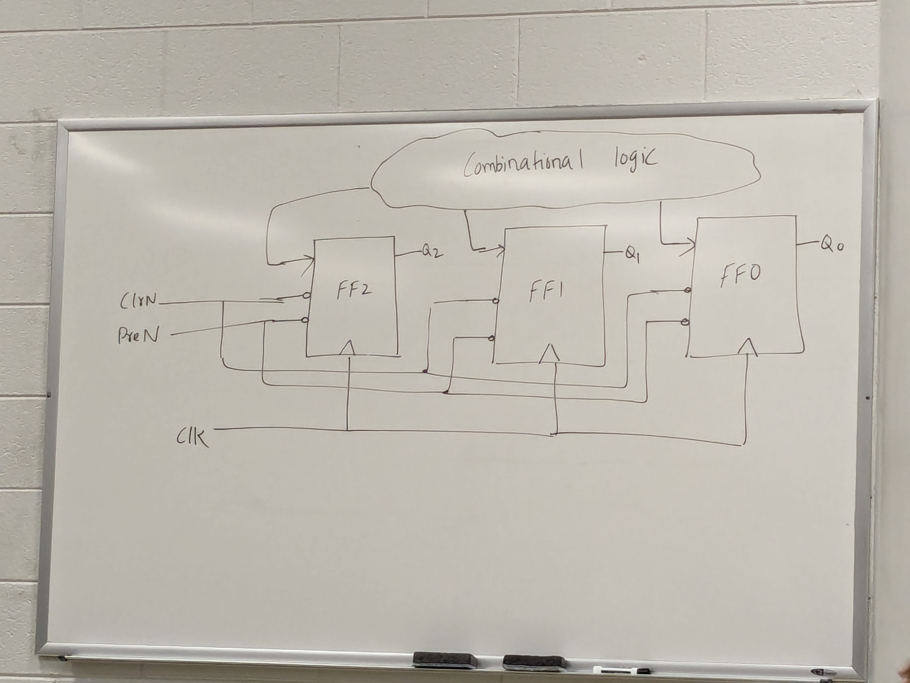

# Class 21

## Flip-Flops with Addition Inputs

```
       +-----+
D    --|     |-- Q
ClrN --| DFF |
PreN --|     |-- Q'
       +-----+
```

ClrN and PreN are asyncronous and active low
**Clear:** ClrN = 0, Q = 0
**Set:** PreN = 0, Q = 1

### Behavioral VHDL
```vhdl
-- 4:1 MUX
library ieee;
use ieee.std_logic_1164.all;

entity mux4to1 is
    port (A, B, C, D, S1, S0 : in  std_logic;
          F                  : out std_logic);
end;

architecture arch of mux4to1 is
begin 
    process(A, B, C, D, S1, S0) -- Sensitivity list
    begin
        if (S1 = '0' and S0 = '0') then
            F <= A;
        elsif (S1 = '0' and S0 = '1') then
            F <= B;
        elsif (S1 = '1' and S0 = '0') then
            F <= C;
        else
            F <= D;
        end if;
    end process;
end architecture;
```

Sensitivity list defines which signals should cause the behavioral code to execute

#### Another flavor of behavioral code
```vhdl
-- 4:1 MUX
library ieee;
use ieee.std_logic_1164.all;

entity mux4to1 is
    port (A, B, C, D : in  std_logic;
          S          : in  std_logic_vector(1 downto 0);
          F          : out std_logic);
end;

architecture arch of mux4to1 is
begin 
    process(A, B, C, D, S) -- Sensitivity list
    begin
        case S is
            when "00" =>
                F <= A;
            when "01" =>
                F <= B;
            when "10" =>
                F <= C;
            when "11" =>
                F <= D;
        end case;
    end process;
end architecture;
```

## D Flip-Flop
```vhdl
-- D Flip-Flop with ClrN and PreN
library ieee;
use ieee.std_logic_1164.all;

entity DFlipFlop is
    port (D, CLK, ClrN, PreN : in  std_logic,
          Q                  : out std_logic);
end;

architecture arch of DFlipFlop is
begin 
    process (CLK, ClrN, PreN)
    begin
        if ClrN = '0' then
            Q <= '0';
        elsif PreN = '0' then
            Q <= '1';
        elsif CLK'event and CLK = '1' then -- Rising Edge
            Q <= D;
        end if;
    end process;
end architecture;
```

Assuming they are synchronous, write the architecture:
```vhdl
library ieee;
use ieee.std_logic_1164.all;

entity SyncDFF is
    port (D, CLK, ClrN, PreN : in  std_logic;
          Q                  : out std_logic);
end;

architecture arch of SyncDFF is
begin 
    process (CLK)
    begin
        if CLK'event and CLK = '1' then
            if ClrN = '0' then
                Q <= '0';
            elsif PreN = '0' then
                Q <= '1';
            else
                Q <= D;
            end if;
        end if;
    end process;
end architecture;
```

Use the push buttons for a clock

## Counters
Something that counts

Could be 010 -> 110 -> 000 -> 011 -> 010 -> 110 -> ....

If you are counting with N bits, you will require at least N flip flops

When the rising edge of the clock is seen, then it will transition to the next state

Output of the counter is the combination of the flip flop outputs



| Q2  | Q1  | Q0  | Q2+ | Q1+ | Q0+ | D2  | D1  | D0  |
| --- | --- | --- | --- | --- | --- | --- | --- | --- |
| 0   | 0   | 0   | 0   | 1   | 1   | 0   | 1   | 1   |
| 0   | 0   | 1   | X   | X   | X   | X   | X   | X   |
| 0   | 1   | 0   | 1   | 1   | 0   | 1   | 1   | 0   |
| 0   | 1   | 1   | 0   | 1   | 0   | 0   | 1   | 0   |
| 1   | 0   | 0   | X   | X   | X   | X   | X   | X   |
| 1   | 0   | 1   | X   | X   | X   | X   | X   | X   |
| 1   | 1   | 0   | 0   | 0   | 0   | 0   | 0   | 0   |
| 1   | 1   | 1   | X   | X   | X   | X   | X   | X   |
Next class, we will find equations for D2, D1, and D0 using K-Maps
