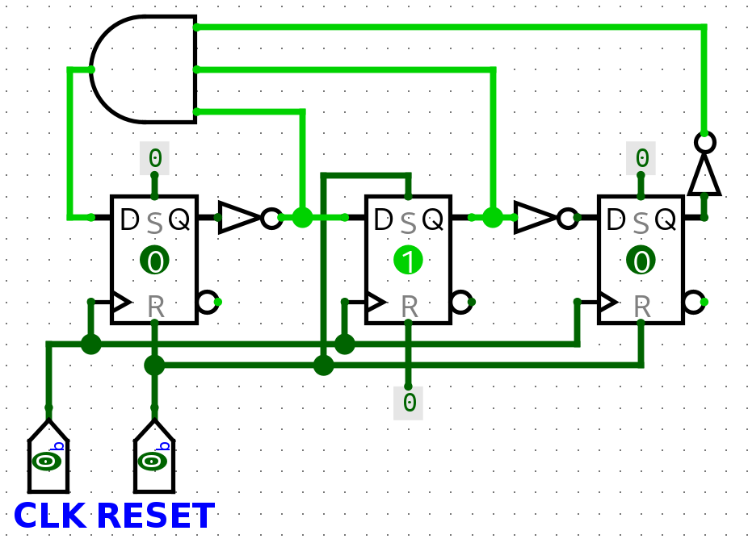

# Class 22

## Counters

010 -> 110 -> 000 -> 011 -> wrap

When reset == '0', output == "010"

If you have 3 outputs, you will have 3 D-FFs

The truth table of a counter is known as the **Excitation Table**

| Q2  | Q1  | Q0  | Q2+ | Q1+ | Q0+ | D2  | D1  | D0  |
| --- | --- | --- | --- | --- | --- | --- | --- | --- |
| 0   | 0   | 0   | 0   | 1   | 1   | 0   | 1   | 1   |
| 0   | 0   | 1   | X   | X   | X   | X   | X   | X   |
| 0   | 1   | 0   | 1   | 1   | 0   | 1   | 1   | 0   |
| 0   | 1   | 1   | 0   | 1   | 0   | 0   | 1   | 0   |
| 1   | 0   | 0   | X   | X   | X   | X   | X   | X   |
| 1   | 0   | 1   | X   | X   | X   | X   | X   | X   |
| 1   | 1   | 0   | 0   | 0   | 0   | 0   | 0   | 0   |
| 1   | 1   | 1   | X   | X   | X   | X   | X   | X   |

K-Maps

| Q2/Q1Q0 | 00  | 01  | 11  | 10  |
| ------- | --- | --- | --- | --- |
| 0       |     | X   |     | 1   |
| 1       | X   | X   | X   |     |
`D2 = Q2'Q1Q0'`

| Q2/Q1Q0 | 00  | 01  | 11  | 10  |
| ------- | --- | --- | --- | --- |
| 0       | 1   | X   | 1   | 1   |
| 1       | X   | X   | X   |     |
`D1 = Q2'`

| Q2/Q1Q0 | 00  | 01  | 11  | 10  |
| ------- | --- | --- | --- | --- |
| 0       | 1   | X   |     |     |
| 1       | X   | X   | X   |     |
`D0 = Q1'`

#### Steps
1. Excitation Table
2. K-Maps
3. Draw the Circuit

**NOTE: Logisim has active high ClrN(R) and PreN(S) so I just inverted the inputs**



```vhdl
--- DFF
library ieee;
use ieee.std_logic_1164.all;

entity ffd is
    port(D, CLK, ClrN, PreN : in  std_logic;
         Q                  : out std_logic);
end;

architecture arch of ffd is
begin process (CLK)
    begin
        if CLK'event and clk = '1' then
            if ClrN = '0' then
                Q <= '0';
            elsif PreN = '0' then
                Q <= '1';
            else
                Q <= D;
            end if;
        end if;
    end process;
end architecture;
```

```vhdl
--- Counter
library ieee;
use ieee.std_logic_1164.all;

entity counter is
    port(CLK, RESET : in  std_logic;
         Q          : buffer std_logic_vector(2 downto 0));
end;

architecture arch of counter is
component ffd is
    port(D, CLK, ClrN, PreN : in  std_logic;
         Q                  : out std_logic);
end component;
signal Qbar : std_logic_vector(2 downto 0);
signal D2_INPUT : std_logic;
begin
    Qbar(2) <= not Q(2);
    Qbar(1) <= not Q(1);
    Qbar(0) <= not Q(0);

    D2_INPUT <= Qbar(2) and Q(1) and Qbar(0);

    FF0 : ffd port map (Qbar(1),  CLK, RESET, '1',   Q(0));
    FF1 : ffd port map (Qbar(2),  CLK, '1',   RESET, Q(1));
    FF2 : ffd port map (D2_INPUT, CLK, RESET, '1',   Q(2));
end architecture;
```

You have to make Q a buffer so that it can be read and outputted

---

Lab problem:
Make a counter that does this sequence:
001 -> 101 -> 110 -> 111 -> 000

| Q2  | Q1  | Q0  | Q2+ | Q1+ | Q0+ | D2  | D1  | D0  |
| --- | --- | --- | --- | --- | --- | --- | --- | --- |
| 0   | 0   | 0   | 0   | 0   | 1   | 0   | 0   | 1   |
| 0   | 0   | 1   | 1   | 0   | 1   | 1   | 0   | 1   |
| 0   | 1   | 0   | X   | X   | X   | X   | X   | X   |
| 0   | 1   | 1   | X   | X   | X   | X   | X   | X   |
| 1   | 0   | 0   | X   | X   | X   | X   | X   | X   |
| 1   | 0   | 1   | 1   | 1   | 0   | 1   | 1   | 0   |
| 1   | 1   | 0   | 1   | 1   | 1   | 1   | 1   | 1   |
| 1   | 1   | 1   | 0   | 0   | 0   | 0   | 0   | 0   |
D2:

| Q2/Q1Q0 | 00  | 01  | 11  | 10  |
| ------- | --- | --- | --- | --- |
| 0       |     | 1   | X   | X   |
| 1       | X   | 1   |     | 1   |
`D2 = Q1'Q0 + Q1Q0'`

D1

| Q2/Q1Q0 | 00  | 01  | 11  | 10  |
| ------- | --- | --- | --- | --- |
| 0       |     |     | X   | X   |
| 1       | X   | 1   |     | 1   |
`D1 = Q2Q1' + Q1Q0'`

D0

| Q2/Q1Q0 | 00  | 01  | 11  | 10  |
| ------- | --- | --- | --- | --- |
| 0       | 1   | 1   | X   | X   |
| 1       | X   |     |     | 1   |
`D0 = Q2' + Q0'`
