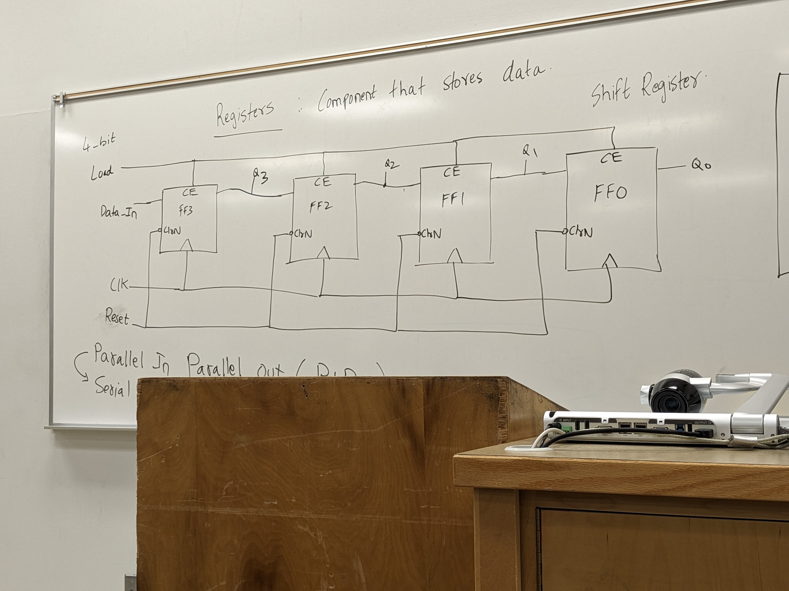

# Class 23

Final will be on sequential circuits
- 5 timing problems
- 1 excitation table
- 1 registers
- 1 Mealy and/or Moore FSM
3 sides of notes

---

## Registers
Component that stores data

32-bit computer will typically have 32 registers that can each hold a 32-bit value
64-bit computer will typically have 64 registers that can each hold a 64-bit value

All the registers are known as your register file
Its very expensive and bulky but fast

```c
void main() {
    z = a + b + c + d;
}
```
gets converted to assembly
```ASM
ADD R5, R1, R2
ADD R6, R3, R4
ADD R10, R5, R6
```

Design of a 4-bit register


When reset = 0 and
       rising edge of clock, Q(3:0) = "0000"
When reset = 1 and
       load = 1 and
       rising edge of clock, Q(3:0) = D(3:0)

This is called a **Parallel In Parallel Out (PIPO)**

What about a **Serial In Parallel Out**?
You connect the data in to the data out of the previous Flip-Flop
This is called a **Shift Register**


This shifts the data over by one bit each clock cycle.
They are used to design Johnson's Counter/Ring Counter. -- Interview Question

---

### Design Problem

Given the design, how many clock cycles are needed to make the register to get to "1111"?


