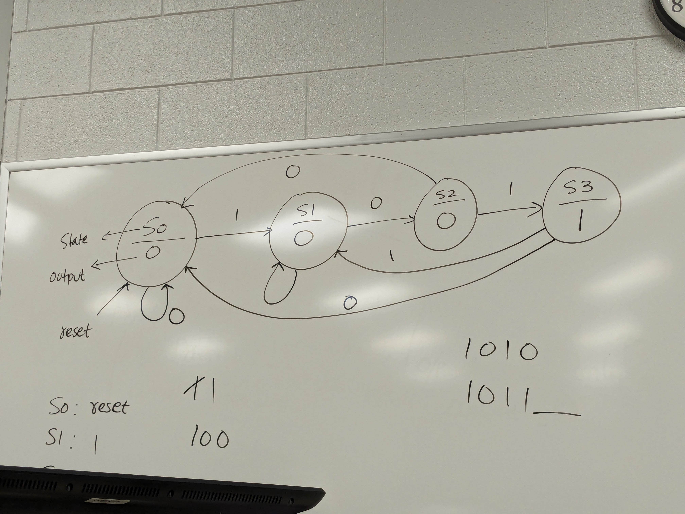

# Class 24

```vhdl
-- N-bit PIPO Registry
library ieee;
use ieee.std_logic_1164.all;

entity pipo_reg is
    generic (N : integer := 4); -- N is size 4 by default
    port (CLK, RESET, LOAD : in  std_logic;
          DATA_IN          : in  std_logic_vector(N-1 downto 0);
          DATA_OUT         : out std_logic_vector(N-1 downto 0));
end entity;

architecture arch of pipo_reg is
begin 
    process (CLK)
    begin
        if CLK'event and CLK = '1' then
            if RESET = '0' then
                DATA_OUT <= (others => '0');
            elsif LOAD = '1' then
                DATA_OUT <= DATA_IN;
            end if;
        end if;
    end process;
end architecture;
```

---

Left-shifting by 1 is multiplication by 2
Left-shifting by N is multiplication by 2^N

**Asked during intel interview**

Right-shifting by 1 is division by 2
Right-shifting by N is division by 2^N

---

```vhdl
-- N-bit right shift register
-- He is making a 4 bit one but 
-- I am making mine a generic one
-- so you can figure the rest
library ieee;
use ieee.std_logic_1164.all;

entity right_shift_reg is
    generic (N : integer  4);
    port (CLK, RESET, LOAD, DATA_IN : in  std_logic;
          DATA_OUT                  : out std_logic_vector(N-1 downto 0));
end entity;

architecture arch of right_shift_reg is
signal TEMP : std_logic_vector(N-1 downto 0);
begin 
    process (CLK);
    begin
        if CLK'event and CLK = '1' then
            if RESET = '0' then
                TEMP <= (others => '0');
            elsif LOAD = '1' then
                TEMP <= DATA_IN & TEMP(N-1 downto 1);
            end if;
        end if;
    end process;
    DATA_OUT <= TEMP;
end architecture;
```

---

## Finite State Machines (FSM)

**2 types:**
1. Mealy Machine/FSM
2. Moore Machine/FSM

Four fundamental concepts in FSMs
1. States (Sx and Sy)
2. Transitions (When in Sx, you can either stay in Sx or move to Sy and vise versa)
3. Inputs (Decides what transition you have to make)
4. Outputs (You can assert outputs based on state) (Symbol => Input/Output eg. 1/1)

#### Mealy Machines
Output depends on:
- Current state
- Current input

#### Moore Machines
Output depends on:
- Current state

Sequence Detector: Target output is to detect 101 with no overlap

| CLK   | 1   | 2   | 3   | 4   | 5   | 6   | 7   | 8   | 9   | 10  |
| ----- | --- | --- | --- | --- | --- | --- | --- | --- | --- | --- |
| X     | 0   | 1   | 0   | 1   | 1   | 0   | 1   | 0   | 1   | 0   |
| Moore | 0   | 0   | 0   | 0   | 1   | 0   | 0   | 1   | 0   | 0   |
| Mealy | 0   | 0   | 0   | 1   | 0   | 0   | 1   | 0   | 0   | 0   |

In Moore FSM, output is asserted one clock cycle after sequence detection
In Mealy FSM, output is asserted the clock cycle the sequence is detected

Moore FSM model for this detector


### Design Problem
Detect 1010, Moore, No Overlap
