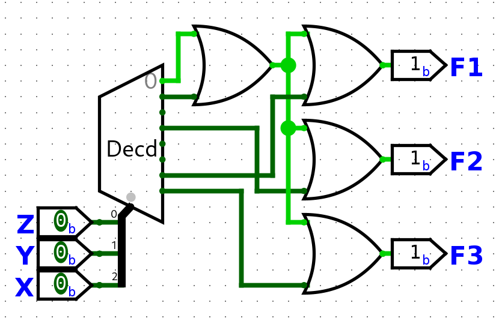

1. Critical Path:
    - G1 -> G3 -> G4 -> G6     Total Time: 1 + 1 + 1 +1 = 4ns
    - G2 -> G5 -> G6     Total Time: 3 + 1 + 3 = 7ns
    - Path 1: G1 -> G3 -> G4 -> G6     Total Time: 1 + 1 + 1 + 1 = 4ns
    - Path 2: G2 -> G5 -> G6     Total Time: 1 + 2 + 1 = 4ns
    - Path 3: G2 -> G5 -> G7     Total Time: 1 + 2 + 1 = 4ns
    - Path 4: G1 -> G5 -> G6     Total Time: 1 + 2 + 1 = 4ns
    - Path 5: G1 -> G5 -> G7     Total Time: 1 + 2 + 1 = 4ns

1. Convert
    a. K-Map:

| AB\\CD | 00  | 01  | 11  | 10  |
| ------ | --- | --- | --- | --- |
| 00     |     |     | 1   |     |
| 01     |     |     |     |     |
| 11     |     |     | 1   | 1   |
| 10     |     |     | 1   | 1   |
    ~~SOP = m3 + m10 + m11 + m14 + m15~~
    SOP = AD(B + B')(D + D') + (A + A')(B'CD)
    **SOP = ABCD + ABC'D + AB'CD + AB'C'D + A'B'CD**
    b. K-Map:

| AB\\CD | 00  | 01  | 11  | 10  |
| ------ | --- | --- | --- | --- |
| 00     |     | 0   |     |     |
| 01     |     |     |     |     |
| 11     | 0   |     |     | 0   |
| 10     | 0   | 0   |     | 0   |
    ~~POS = M1 * M8 * M9 * M10 * M12 * M14~~
    POS = (B + C + D '+ A * A')(A' + D + C * C' + B * B')
    POS = (B + C + D' + A)(B + C + D' + A')(A' + D + CC' + B)(A' + D + CC' + B')
    **POS = (B + C + D' + A)(B + C + D' + A')(A' + D + C + B)(A' + D + C + B')(A' + D + C' + B)(A' + D + C' + B')**

3. K-Map:

| AB\\CD | 00  | 01  | 11  | 10  |
| ------ | --- | --- | --- | --- |
| 00     | 1   | 1   | 1   | 1   |
| 01     | 1   | 1   | 0   | 1   |
| 11     | 1   | 0   | 0   | 0   |
| 10     | 1   | 1   | 0   | 0   |
- F = m0 + m1 + m2 + m3 + m4 + m5 + m6 + m8 + m9 + m12
- F = A'B' + C'D' + A'C' + B'C' + A'D'
- F = M7 * M10 * M11 * M13 * M14 * M15
- F = (A' + B' + D')(B' + C' + D')(A' + C')

4. K-Map:

| AB\\CD | 00  | 01  | 11  | 10  |
| ------ | --- | --- | --- | --- |
| 00     | X   | 0   | X   | 1   |
| 01     | 1   | X   | 1   | X   |
| 11     | X   | 0   | X   | 1   |
| 10     | 0   | X   | 1   | X   |
- F = ∑m(2, 4, 7, 11, 14) +  ∑d(0, 3, 5, 6, 9, 10, 12, 15)
- F = πM(1, 8, 13) * πD(0, 3, 5, 6, 9, 10, 12, 15)

5. K-Map:

| AB\\CD | 00  | 01  | 11  | 10  |
| ------ | --- | --- | --- | --- |
| 00     | 1   | 1   | X   |     |
| 01     |     |     | X   | 1   |
| 11     | 1   |     | X   | X   |
| 10     | 1   |     | 1   |     |
- F = CD + BC + A'B'C' + AC'D'

| AB\\CD | 00  | 01  | 11  | 10  |
| ------ | --- | --- | --- | --- |
| 00     |     | 0   | 0   | X   |
| 01     | 0   |     | X   |     |
| 11     | X   |     | X   | X   |
| 10     | X   |     | 0   |     |
- F = (B' + C + D)(C' + D')(A + B + D')

6. 

| A   | B   | C   | D   | F   |
| --- | --- | --- | --- | --- |
| 0   | 0   | 0   | 0   | 1   |
| 0   | 0   | 0   | 1   | 0   |
| 0   | 0   | 1   | 0   | 0   |
| 0   | 0   | 1   | 1   | 0   |
| 0   | 1   | 0   | 0   | 1   |
| 0   | 1   | 0   | 1   | 1   |
| 0   | 1   | 1   | 0   | 0   |
| 0   | 1   | 1   | 1   | 0   |
| 1   | 0   | 0   | 0   | 0   |
| 1   | 0   | 0   | 1   | 0   |
| 1   | 0   | 1   | 0   | 1   |
| 1   | 0   | 1   | 1   | 1   |
| 1   | 1   | 0   | 0   | 1   |
| 1   | 1   | 0   | 1   | 1   |
| 1   | 1   | 1   | 0   | 1   |
| 1   | 1   | 1   | 1   | 1   |

7.

| AB\\CD | 00  | 01  | 11  | 10  |
| ------ | --- | --- | --- | --- |
| 00     |     | 1   | 1   |     |
| 01     | 1   | 1   | 1   |     |
| 11     | 1   |     |     |     |
| 10     | 1   | 1   |     |     |
~~Implicants: 1, 3, 4, 5, 7, 8, 9, 12~~
~~PI: 1, 3, 5, 7~~
~~EPI: 9~~
Implicants: 8 (# of implicants)
PI: All the groups
EPI: Groups with 1's only covered by said group

| AB\\CD | 00  | 01  | 11  | 10  |
| ------ | --- | --- | --- | --- |
| 00     | 1   |     | 1   | 1   |
| 01     |     | 1   | 1   |     |
| 11     |     |     | 1   | 1   |
| 10     | 1   |     | 1   | 1   |
~~Implicants: 0, 2, 3, 5, 7, 8, 10, 11, 14, 15~~
~~PI: 10, 11, 14, 15 and 3, 7, 11, 15 and 0, 2, 8, 10~~
~~EPI: 5~~
**SEE PART A**

8.

| F1    |     |     |     |     |
| ----- | --- | --- | --- | --- |
| X\\YZ | 00  | 01  | 11  | 10  |
| 0     | 1   | 1   |     |     |
| 1     |     |     |     | 1   |

| F2    |     |     |     |     |
| ----- | --- | --- | --- | --- |
| X\\YZ | 00  | 01  | 11  | 10  |
| 0     | 1   | 1   | 1   |     |
| 1     |     |     |     |     |

| F3    |     |     |     |     |
| ----- | --- | --- | --- | --- |
| X\\YZ | 00  | 01  | 11  | 10  |
| 0     | 1   | 1   |     |     |
| 1     |     |     | 1   |     |

