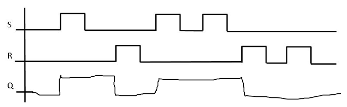
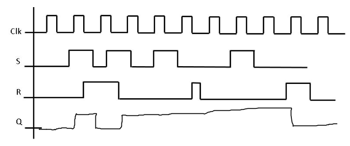
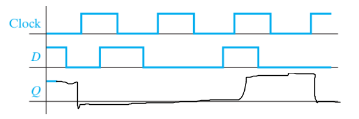
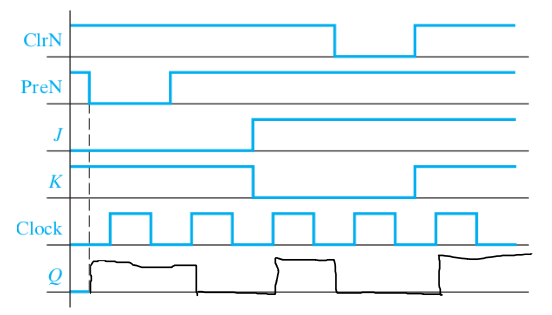
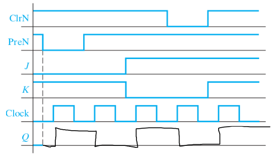
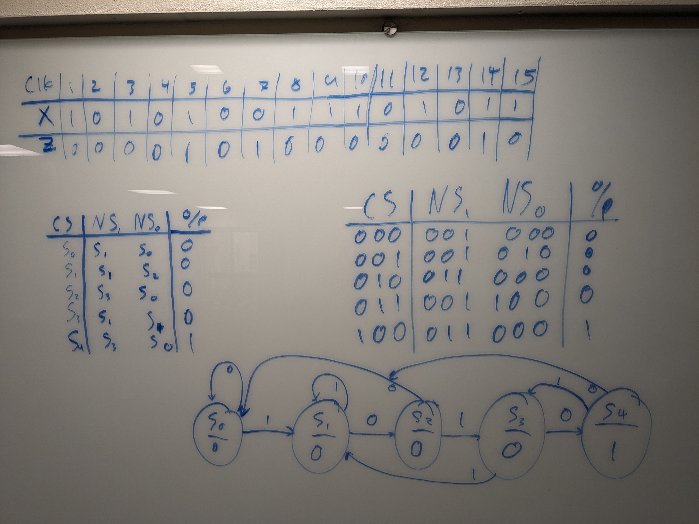
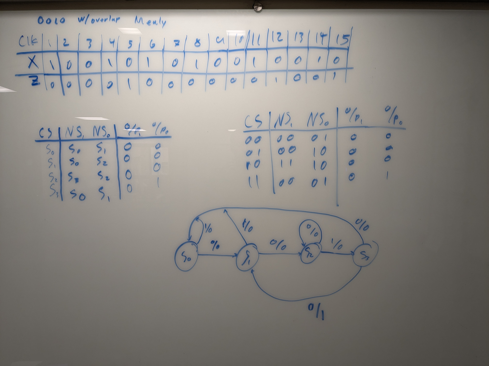

1. 
2. 
3. 
4. 
5. 
6. Truth Table

| L   | M   | Q   | Q+  |
| --- | --- | --- | --- |
| 0   | 0   | 0   | 1   |
| 0   | 0   | 1   | 1   |
| 0   | 1   | 0   | 0   |
| 0   | 1   | 1   | 1   |
| 1   | 0   | 0   | 1   |
| 1   | 0   | 1   | 0   |
| 1   | 1   | 0   | 0   |
| 1   | 1   | 1   | 0   |

7. Excitation Table

| Q2  | Q1  | Q0  | Q2+ | Q1+ | Q0+ | L2  | L1  | L0  | M2  | M1  | M0  |
| --- | --- | --- | --- | --- | --- | --- | --- | --- | --- | --- | --- |
| 0   | 0   | 0   | 1   | 1   | 0   | X   | X   | X   | 0   | 0   | 1   |
| 0   | 0   | 1   | X   | X   | X   | X   | X   | X   | X   | X   | X   |
| 0   | 1   | 0   | X   | X   | X   | X   | X   | X   | X   | X   | X   |
| 0   | 1   | 1   | 1   | 0   | 1   | X   | 1   | 0   | 0   | X   | X   |
| 1   | 0   | 0   | X   | X   | X   | X   | X   | X   | X   | X   | X   |
| 1   | 0   | 1   | 0   | 0   | 0   | 1   | X   | 1   | X   | 1   | X   |
| 1   | 1   | 0   | 1   | 1   | 1   | 0   | 0   | X   | X   | X   | 0   |
| 1   | 1   | 1   | 0   | 1   | 1   | 1   | 0   | 0   | X   | X   | X   |

---

| Q   | Q+  | I   | M   |
| --- | --- | --- | --- |
| 0   | 0   | X   | 1   |
| 0   | 1   | X   | 0   |
| 1   | 0   | 1   | X   |
| 1   | 1   | 0   | X   |

8. 

| Q2  | Q1  | Q0  | Q2+ | Q1+ | Q0+ | S2  | S1  | S0  | R2  | R1  | R0  |
| --- | --- | --- | --- | --- | --- | --- | --- | --- | --- | --- | --- |
| 0   | 0   | 0   | 1   | 1   | 0   | 1   | 1   | 0   | 0   | 0   | X   |
| 0   | 0   | 1   | X   | X   | X   | X   | X   | X   | X   | X   | X   |
| 0   | 1   | 0   | X   | X   | X   | X   | X   | X   | X   | X   | X   |
| 0   | 1   | 1   | 1   | 0   | 1   | 1   | 0   | X   | 0   | 1   | 0   |
| 1   | 0   | 0   | X   | X   | X   | X   | X   | X   | X   | X   | X   |
| 1   | 0   | 1   | 0   | 0   | 0   | 0   | 0   | 0   | 1   | X   | 1   |
| 1   | 1   | 0   | 1   | 1   | 1   | X   | X   | 1   | 0   | 0   | 0   |
| 1   | 1   | 1   | 0   | 1   | 1   | 0   | X   | X   | 1   | 0   | 0   |

---

| Q   | Q+  | S   | R   |
| --- | --- | --- | --- |
| 0   | 0   | 0   | X   |
| 0   | 1   | 1   | 0   |
| 1   | 0   | 0   | 1   |
| 1   | 1   | X   | 0   |

9. 
10. 
11. 
    a. It is a Mealy because Z depends on X (Z = X * Qa)
    b. Da = X'(Qb)        Db = X
