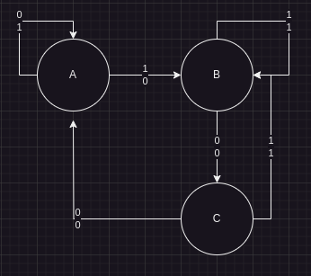
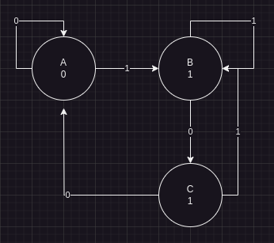

Sometimes the most "optimal" state assignments can be slow. To fix this, we use a different state optimization method.

## One Hot State Assignment

Using the following state machine:



Number of states = Number of flip-flops

Input -> x
Output -> Z

|     | Q1  | Q2  | Q3  |
| --- | --- | --- | --- |
| A   | 1   | 0   | 0   |
| B   | 0   | 1   | 0   |
| C   | 0   | 0   | 1   |

Q1+ = x'Q1 + x'Q3
Q2+ = xQ1 + xQ2 + xQ3
Q3+ = x'Q2

Z = x'Q1 + xQ2 + xQ3

### One Moore Example
*comedy*



Q1+ = x'Q1 + x'Q2
Q2+ = xQ1 + xQ2 + xQ3
Q3+ = x'Q2

Z = Q2 + Q3

---

### VHDL
VHSI (Very High Speed Integrated Circuit) Hardware Description Language

In VHDL code, you have two parts:
- Entity
- Architecture

Assume we have a black-box circuit with three inputs A, B, C and an output F

```vhdl
library ieee;
use ieee.std_logic_1164.all;

-- Describes the input, output, an name of a circuit
entity CKT1 is
port(
	A, B, C : in  std_logic;
	F       : out std_logic
);
end CKT1;
```
