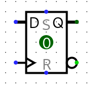

### Continuing VHDL Combinational Circuit

```vhdl
library ieee;
use ieee.std_logic_1164.all;

-- Describes the input, output, an name of a circuit
entity CKT1 is
port(
	A, B, C : in  std_logic;
	F       : out std_logic);
end CKT1;

-- Describes the behavior of the circuit
architecture CKT1_FUNC of CKT1 is
-- Define signals here
begin
	F <= (A and B) or C; -- Whatever logic you want to define
end CKT1_FUNC;
```

---

### Sequential Circuits

Now we will make a simple D Flip Flop



Assume this is a rising edge DFF

| CLK | 0   | 1   | 1   | 0   | 0   | 1     | 1   | 0   |
| --- | --- | --- | --- | --- | --- | ----- | --- | --- |
| D   | 0   | 0   | 1   | 1   | 1   | 1     | 0   | 0   |
| Q   | 0   | 0   | 0   | 0   | 0   | **1** | 1   | 1   |

---
### Level Triggered
A positive level triggered DFF would output D when the clock is high and will remember what the last D value was when the clock is low/rising/falling.

---

```vhdl
-- Goes into the architecture section of your VHDL
process (CLK)
begin
	-- Rising edge detection
	if (CLK'event and CLK = '1') then
		Q <= D;
	end if;
end process;
```

The keyword `process`executes whenever any signal in the sensitivity changes. The sensitivity list is in the the parentheses after the `process` keyword. Hence, this process only changes when `CLK` changes.

### Asynchronous Resets
We will now add a reset to the circuit. An asynchronous reset overrides the clock when affecting the output of the circuit.

| CLK  | 0   | 1   | 1   | 0   | 0   | 1     | 1     | 0   |
| ---- | --- | --- | --- | --- | --- | ----- | ----- | --- |
| CLRN | 1   | 1   | 1   | 1   | 1   | 1     | 0     | 0   |
| D    | 0   | 0   | 1   | 1   | 1   | 1     | 0     | 0   |
| Q    | 0   | 0   | 0   | 0   | 0   | **1** | **0** | 0   |

```vhdl
-- We have to add CLRN to the sensitivity list
process (CLK, CLRN)
begin
	-- Check CLRN first as it will have the highest priority
	if CLRN = '0' then
		Q <= '0';
	elsif CLK'event and CLK = '1' then
		Q <= D;
	end if;
end process;
```

### Synchronous Reset
We will make it a synchronous reset, which means that the circuit will only change when the clock is on the correct edge.

```vhdl
-- We remove CLRN from the sensitivity list
process (CLK)
begin
	-- Check CLK first, then check if reset is triggered
	if CLK'event and CLK = '1' then
		if CLRN = '0' then
			Q <= '0';
		else
			Q <= D;
		end if;
	end if;
end process;
```
