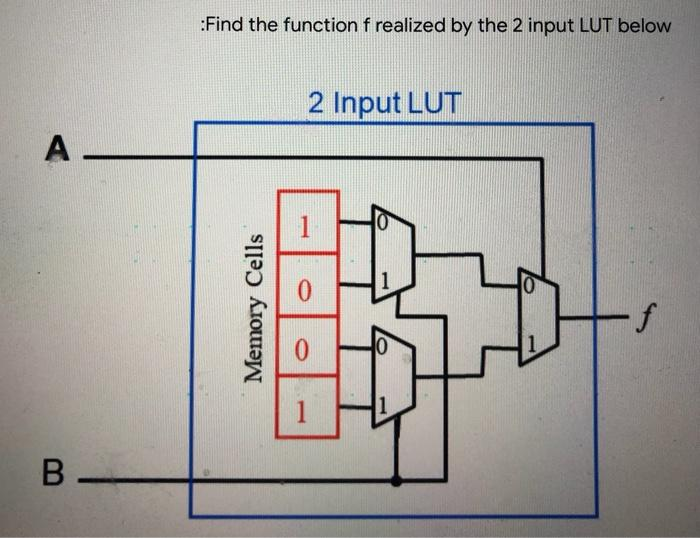
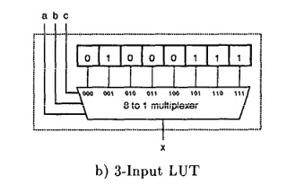

Note: Missed Class. Notes are just from recap

---

Covered multi-input LUTs and how to implement a 2-input LUT

### 2-Input LUT

### 3-Input LUT:

Then we covered how to convert functions to LUTs

#### Example 1:
F = X1X2' using 3 i/p LUT
- X1X2'(X3 + X3')
- (X1X2'X3) + (X1X2'X3')

#### Example 2:
F = X1X2' + X1'X3
- X1X2'(X3 + X3') + X1'X3(X2 + X2')
- X1X2'X3 + X1X2'X3' + X1'X2X3 + X1'X2'X3

| LUT |
| --- |
| 0   |
| 1   |
| 0   |
| 1   |
| 1   |
| 1   |
| 0   |
| 0   |
