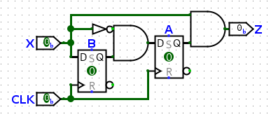

From Last Class:

| PS (AB) | NS->0 (A+B+) | NS->1 (A+B+) | O/P->0 (Z) | O/P->1 (Z) |
| ------- | ------------ | ------------ | ---------- | ---------- |
| 00      | 00           | 01           | 0          | 0          |
| 01      | 10           | 01           | 0          | 0          |
| 10      | 00           | 01           | 0          | 1          |
| 11      | XX           | XX           | X          | X          |
3. Realize with K-Maps

| A+ (X\\AB) | 00  | 01  | 11  | 10  |
| ---------- | --- | --- | --- | --- |
| 0          |     | 1   | X   |     |
| 1          |     |     | X   |     |
A+ = BX'

| B+ (X\\AB) | 00  | 01  | 11  | 10  |
| ---------- | --- | --- | --- | --- |
| 0          |     |     | X   |     |
| 1          | 1   | 1   | X   | 1   |
B+ = X

| O/P (X\\AB) | 00  | 01  | 11  | 10  |
| ----------- | --- | --- | --- | --- |
| 0           |     |     | X   |     |
| 1           |     |     | X   | 1   |
Z = AX

4. Make Circuit Diagram

