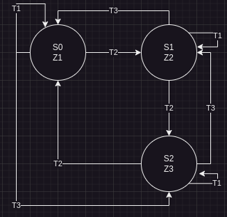
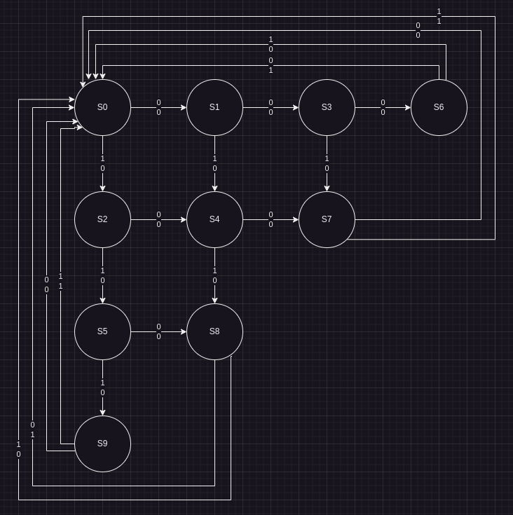

Fixed Diagram:
`T1 = F'R'`
`T2 = F`
`T3 = F'R`

You can prove it follows the rules using boolean algebra:

P1 => T1 + T2 + T3 = 1
=> F'R' + F'R + F = 1
=> F'(R' + R) + F = 1
=> F' + F = 1
=> 1 = 1
It satisfies the requirements of P1

P2 => T1 * T2 = 0
=> F'R' * F
=> (**F' * F***)R' = 0
P2 => T1 * T3 = 0
=> F'R' * F'R = 0
=> F'(**R' * R**) = 0
P2 => T2 * T3 = 0
=> F * F'R = 0
=> (**F' * F***)R = 0
It satisfies the requirements of P2

---

### State Table

| PS  | NS 00 | NS 01 | NS 10 | NS 11 | O/P |
| --- | ----- | ----- | ----- | ----- | --- |
| S0  | S0    | S2    | S1    | S1    | 100 |
| S1  | S1    | S0    | S2    | S2    | 010 |
| S2  | S2    | S1    | S0    | S0    | 001 |

---
## Incompletely Specified FSM

In some situations, a particular sequence will never occur. We add Don't Care (X) to the state table. Therefore:
	A state table containing don't cares is an incompletely specified FSM
Example: Disjoint window BCD inputs

Want to detect a BCD with even parity

| Binary | Decimal | O/P |
| ------ | ------- | --- |
| `0000` | 0       | 1   |
| `0001` | 1       | 0   |
| `0010` | 2       | 0   |
| `0011` | 3       | 1   |
| `0100` | 4       | 0   |
| `0101` | 5       | 1   |
| `0110` | 6       | 1   |
| `0111` | 7       | 0   |
| `1000` | 8       | 0   |
| `1001` | 9       | 1   |
State Machine:

