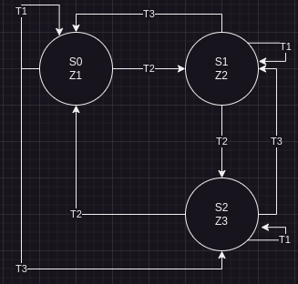

# Class 4

### Moore Machine
To detect the sequence: `101`

State Diagram:

### Alphanumeric FSM
A sequential circuit with many inputs.
It's not effective to label state with 1s and 0s

2 inputs: F (forward) and R (reverse)
Outputs: Z1, Z2, Z3....Zn

Alphanumeric Diagram:

Diagram with values:

How to fix deadlocks?

For every state:
- P1: For any combination of inputs, at least one transition state is enabled. (Deadlocks)
- P2: For any combination of inputs, no more than one transition is enabled. (Deterministic)

Fixed Diagram:
`T1 = F'R'`
`T2 = F`
`T3 = F'R`

You can prove it follows the rules using boolean algebra:

P1 => T1 + T2 + T3 = 1
=> F'R' + F'R + F = 1
=> F'(R' + R) + F = 1
=> F' + F = 1
=> 1 = 1
It satisfies the requirements of P1

P2 => T1 * T2 = 0
=> F'R' * F
=> (**F' * F***)R' = 0
P2 => T1 * T3 = 0
=> F'R' * F'R = 0
=> F'(**R' * R**) = 0
P2 => T2 * T3 = 0
=> F * F'R = 0
=> (**F' * F***)R = 0
It satisfies the requirements of P2
