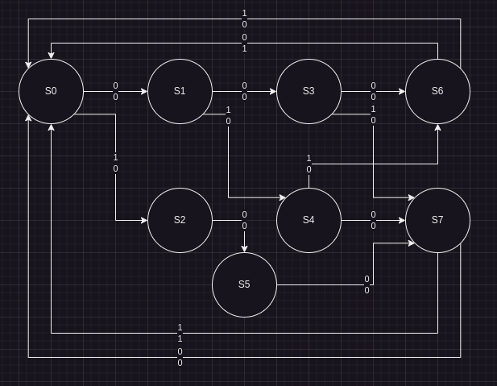

# Class 6

##### State Diagram:

This is an incomplete state machine but contains don't cares that will be taken care of when we write the state table.

##### State Table:

| PS  | NS X=0 | NS X=1 | O/P X=0 | O/P X=1 |
| --- | ------ | ------ | ------- | ------- |
| S0  | S1     | S2     | 0       | 0       |
| S1  | S3     | S4     | 0       | 0       |
| S2  | S5     | X      | 0       | X       |
| S3  | S6     | S7     | 0       | 0       |
| S4  | S7     | S6     | 0       | 0       |
| S5  | S7     | X      | 0       | X       |
| S6  | S0     | S0     | 1       | 0       |
| S7  | S0     | S0     | 0       | 1       |
This is an example of an incomplete state machine

##### State Assigned Table:

| PS  | NS X=0 | NS X=1 | O/P X=0 | O/P X=1 |
| --- | ------ | ------ | ------- | ------- |
| 000 | 001    | 010    | 0       | 0       |
| 001 | 011    | 100    | 0       | 0       |
| 010 | 101    | XXX    | 0       | X       |
| 011 | 110    | 111    | 0       | 0       |
| 100 | 111    | 110    | 0       | 0       |
| 101 | 111    | XXX    | 0       | X       |
| 110 | 000    | 000    | 1       | 0       |
| 111 | 000    | 000    | 0       | 1       |

---

## State Reduction

State Table:

| PS  | NS X=0 | NS X=1 | O/P X=0 | O/P X=1 |
| --- | ------ | ------ | ------- | ------- |
| A   | B      | C      | 0       | 0       |
| B   | D      | E      | 0       | 0       |
| C   | F      | G      | 0       | 0       |
| D   | H      | I      | 0       | 0       |
| E   | J      | K      | 0       | 0       |
| F   | K      | M      | 0       | 0       |
| G   | N      | P      | 0       | 0       |
| H   | A      | A      | 0       | 0       |
| I   | A      | A      | 0       | 0       |
| J   | A      | A      | 0       | 1       |
| K   | A      | A      | 0       | 0       |
| L   | A      | A      | 0       | 1       |
| M   | A      | A      | 0       | 0       |
| N   | A      | A      | 0       | 0       |
| O   | A      | A      | 0       | 0       |

How do we reduce the amount of states?

First, find equivalent states and combine them into one:

| PS         | NS X=0     | NS X=1     | O/P X=0 | O/P X=1 |
| ---------- | ---------- | ---------- | ------- | ------- |
| A          | B          | C          | 0       | 0       |
| B          | D          | E          | 0       | 0       |
| C          | F          | G          | 0       | 0       |
| D          | H          | **H**~~I~~ | 0       | 0       |
| E          | J          | **H**~~K~~ | 0       | 0       |
| F          | **H**~~K~~ | **H**~~M~~ | 0       | 0       |
| G          | **H**~~N~~ | **H**~~P~~ | 0       | 0       |
| **H**      | **A**      | **A**      | **0**   | **0**   |
| **H**~~I~~ | ~~A~~      | ~~A~~      | ~~0~~   | ~~0~~   |
| **J**      | **A**      | **A**      | **0**   | **1**   |
| **H**~~K~~ | ~~A~~      | ~~A~~      | ~~0~~   | ~~0~~   |
| **J**~~L~~ | ~~A~~      | ~~A~~      | ~~0~~   | ~~1~~   |
| **H**~~M~~ | ~~A~~      | ~~A~~      | ~~0~~   | ~~0~~   |
| **H**~~N~~ | ~~A~~      | ~~A~~      | ~~0~~   | ~~0~~   |
| **H**~~O~~ | ~~A~~      | ~~A~~      | ~~0~~   | ~~0~~   |

This may take multiple rounds...

| PS    | NS X=0     | NS X=1     | O/P X=0 | O/P X=1 |
| ----- | ---------- | ---------- | ------- | ------- |
| A     | B          | C          | 0       | 0       |
| B     | D          | E          | 0       | 0       |
| C     | **D**~~F~~ | **D**~~G~~ | 0       | 0       |
| **D** | **H**      | **H**      | **0**   | **0**   |
| E     | J          | H          | 0       | 0       |
| ~~F~~ | ~~H~~      | ~~H~~      | ~~0~~   | ~~0~~   |
| ~~G~~ | ~~H~~      | ~~H~~      | ~~0~~   | ~~0~~   |
| H     | A          | A          | 0       | 0       |
| J     | A          | A          | 0       | 1       |

And clean it up...

| PS  | NS X=0 | NS X=1 | O/P X=0 | O/P X=1 |
| --- | ------ | ------ | ------- | ------- |
| A   | B      | C      | 0       | 0       |
| B   | D      | E      | 0       | 0       |
| C   | D      | D      | 0       | 0       |
| D   | H      | H      | 0       | 0       |
| E   | J      | H      | 0       | 0       |
| H   | A      | A      | 0       | 0       |
| J   | A      | A      | 0       | 1       |

Equivalent States:
Given states N1(P) and N2(Q), how can you determine if the two states are equivalent?

They are equivalent when for each value of X, Z1 and Z2 are the same where Z1 = L1(P, X) and Z2 = L2(Q,X)
