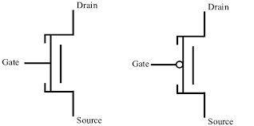

# Class 8

## State Machine Equivalence

#### N1:

| PS  | NS X=0 | NS X=1 | O/P X=0 | O/P X=1 |
| --- | ------ | ------ | ------- | ------- |
| A   | B      | A      | 0       | 0       |
| B   | C      | D      | 0       | 1       |
| C   | A      | C      | 0       | 1       |
| D   | C      | B      | 0       | 0       |

#### N2:

| PS  | NS X=0 | NS X=1 | O/P X=0 | O/P X=1 |
| --- | ------ | ------ | ------- | ------- |
| S0  | S3     | S1     | 0       | 1       |
| S1  | S3     | S0     | 0       | 0       |
| S2  | S0     | S2     | 0       | 0       |
| S3  | S2     | S3     | 0       | 1       |

#### State Comparison

| S0          | **X**                | C <=> S3 D <=> S1 | A <=> S3 C <=> S1 | **X**                |
| ----------- | -------------------- | -------------------- | -------------------- | -------------------- |
| S1          | B <=> S3 A <=> S0 | **X**                | **X**                | C <=> S3 B <=> S0 |
| S2          | B <=> S0 A <=> S2 | **X**                | **X**                | C <=> S0 B <=> S2 |
| S3          | **X**                | C <=> S2 D <=> S3 | A <=> S2 C <=> S3 | **X**                |
| ***N2/N1*** | A                    | B                    | C                    | D                    |

Round 2, FIGHT!

| S0          | **X**                | C <=> S3 D <=> S1 | ~~**X**~~            | **X**                |
| ----------- | -------------------- | -------------------- | -------------------- | -------------------- |
| S1          | ~~**X**~~            | **X**                | **X**                | C <=> S3 B <=> S0 |
| S2          | B <=> S0 A <=> S2 | **X**                | **X**                | ~~**X**~~            |
| S3          | **X**                | ~~**X**~~            | A <=> S2 C <=> S3 | **X**                |
| ***N2/N1*** | A                    | B                    | C                    | D                    |

All done!

Now we compare the tables
N1 <=> N2
A <=> S2
B <=> S0
C <=> S3
D <=> S1

Since they are all different, we can therefore conclude that the state machines are identical.

## Optimal Methods for State Assignment
That will result in the least hardware. (Hopefully)

| PS (Bits) | PS  | NS X=0 | NS X=1 |
| --------- | --- | ------ | ------ |
| 000       | S0  | S1     | S2     |
| 001       | S1  | S3     | S2     |
| 010       | S2  | S1     | S4     |
| 011       | S3  | S5     | S2     |
| 100       | S4  | S1     | S6     |
| 101       | S5  | S5     | S2     |
| 110       | S6  | S1     | S6     |

What happens if we change the order? Say to:

| State | Bits |
| ----- | ---- |
| S0    | 111  |
| S1    | 110  |
| S2    | 101  |
| S3    | 100  |
| S4    | 011  |
| S5    | 010  |
| S6    | 001  |

# Guidelines for State Assignment

1. States which have the same next state for a given input should be given adjacent state assignments (adjacent state assignments are only one bit changes; eg. 00 => 01, 10)

2. States which are next states of the same state should be given adjacent assignment

3. State which have the same output for a given input should be given adjacent assignment

Aside: Transistors

N-type and P-type

N-type is closed when gate is `1`
P-type is closed when gate is `0`

N-type and P-type symbols, respectively:

There is what is called the "gate capacitor" because of how transistors are made physically. When you turn a transistor on or off, you are charging and discharging the gate capacitor.

Hence, transitions consume energy, which we don't like.
