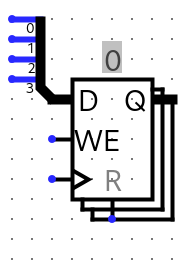

# Class 12

### Synchronous Register

Registers are just multiple flip flops.



```vhdl
process (CLK)
begin
	-- This also detects a rising edge
	if rising_edge(CLK) then
		if CLR = '1' then 
			Q <= "0000";
		-- LD is the same as WE in the picture above (LoaD vs Write Enable)
		elsif LD = '1' then
			Q <= D;
		end if;
	end if;
end process;
```

### Counter
Now we will make this a 4-bit counter.

Using ports `CLK`, `CLRN`, `Q_OUT`, `EN`

```vhdl
signal Q : std_logic_vector(3 downto 0);
process (CLK)
begin
	if rising_edge(CLK) then
		if CLRN = '0' then
			Q <= "0000";
		elsif EN = '1' then
			Q <= Q + 1; -- The add function is defined by std_logic_vector
		end if;
	end if;
end process;
Q_OUT <= Q;
```

### Coding FSM
Now we will code a finite state machine.

| PS  | NS X=0 | NS X=1 | Z X=0 | Z X=1 |
| --- | ------ | ------ | ----- | ----- |
| S0  | S1     | S2     | 1     | 0     |
| S1  | S3     | S4     | 1     | 0     |
| S2  | S4     | S4     | 0     | 1     |
| S3  | S5     | S5     | 0     | 1     |
| S4  | S5     | S6     | 1     | 0     |
| S5  | S0     | S0     | 0     | 1     |
| S6  | S0     | X      | 1     | X     |

```vhdl
entity FSM is
	port(
		X, CLK : in  std_logic;
		Z      : out std_logic);
end entity;

architecture ARCH of FSM is
signal STATE, NEXT_STATE : integer range 0 to 6 : 0;
begin
-- Processs for determining the output and next state
-- AKA this process defines the behavior of the state table
process (STATE, X) begin
	case STATE is
	when 0 =>
		if X = '0' then
			Z <= '1';
			NEXT_STATE <= 1;
		else
			Z <= '0';
			NEXT_STATE <= 2;
		end if;
	when 1 =>
		if X = '0' then
			Z <= '1';
			NEXT_STATE <= 3;
		else
			Z <= '0';
			NEXT_STATE <= 4;
		end if;
	when 2 =>
		if X = '0' then
			Z <= '0';
			NEXT_STATE <= 4;
		else
			Z <= '1';
			NEXT_STATE <= 4;
		end if;
	when 3 =>
		if X = '0' then
			Z <= '0';
			NEXT_STATE <= 5;
		else
			Z <= '1';
			NEXT_STATE <= 5;
		end if;
	when 4 =>
		if X = '0' then
			Z <= '1';
			NEXT_STATE <= 5;
		else
			Z <= '0';
			NEXT_STATE <= 6;
		end if;
	when 5 =>
		if X = '0' then
			Z <= '0';
			NEXT_STATE <= 0;
		else
			Z <= '1';
			NEXT_STATE <= 0;
		end if;
	when 6 =>
		if X = '0' then
			Z <= '1';
			NEXT_STATE <= 0;
		-- Since the state table has this a a don't care,
		-- we can just not include the else case
		end if;
	end case;
end process;
-- Process for updating the current state
process (CLK) begin
	if rising_edge(CLK) then
		STATE <= NEXT_STATE;
	end if;
end process;
end architecture;
```
