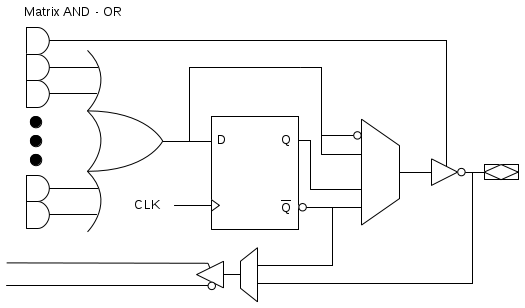

# Class 13

### Programmable Hardware

There are many different types of hardware, including ASIC (Application Specific Integrated Circuit) which is not re-programmable. However, there are some re-programmable hardware types:
##### FPGA
- Field Programmable Gate Array
- Most common re-programmable hardware
##### PLA
- Programmable Logic Arrays
- Older type of re-programmable hardware
- Programmable 'AND' plane
- Programmable 'OR' plane
##### PAL
- Programmable Array Logic
- Programmable 'AND' plane
##### CPLD
- Complex Programmable Logic Device
- Many PAL/PLA inside

The last three use configurable interconnects to create logic.

To connect between the logic and I/O pins, you have to use macro cells.

