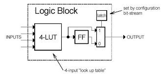
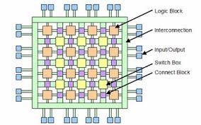

# Class 15

### FPGAs

- Configurable (Programmable)
- General Logic Blocks made of LUTs
- Configurable Interconnects
- Memory Blocks called Block RAM (BRAM)
- May have special purpose blocks

Configured multiple times to perform a variety of tasks

###### Basic Logic Block Diagram:

###### Programmable Interconnects

### Levels of Memory
- Registers (Flip Flops)
- Cache (CMOS)
- Main Memory (DRAM)

Using the Von-Neuman architecture

Just using Main Memory is very slow and in-efficient. This is why we use a cache. Using a cache can improve speed and efficiency.

