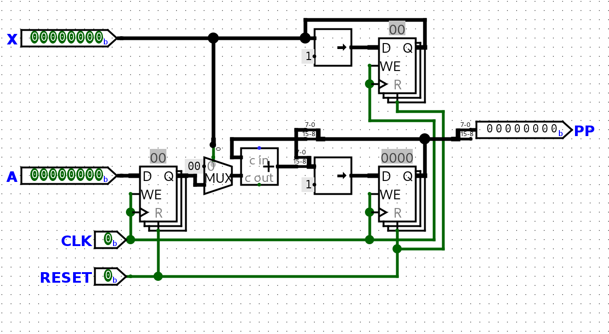

# Class 20

### Example Continued
```js
a = 1010 <=> 10
x = 1011 <=> 11

k = 4 // So we need to go to p4

p0 =  0000_0000
p1 = ((0000_0000) + (1010_0000)) >> 1 = 1010_0000 >> 1 = 0101_0000
p2 = ((0101_0000) + (1010_0000)) >> 1 = 1111_0000 >> 1 = 0111_1000
p3 = ((0111_1000) + (0000_0000)) >> 1 = 0111_1000 >> 1 = 0011_1100
p4 = ((0011_1100) + (1010_0000)) >> 1 = 1101_1110 >> 1 = 0110_1110
p4 <=> 2^7 + 2^6 + 2^4 + 2^3 + 2^2 = 64 + 32 + 8 + 4 + 2 = 110
```

### Hardware
Now that we know the process, how does the hardware work?

###### Partial Product:

