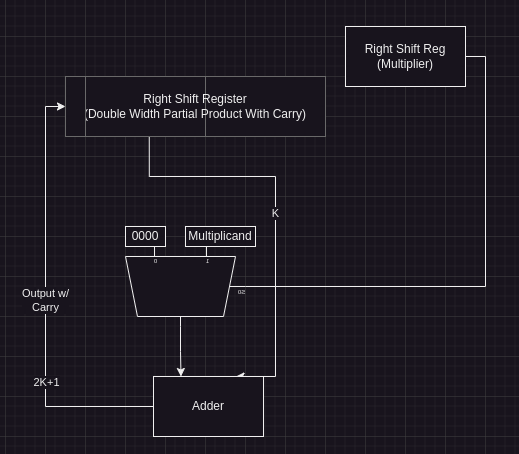
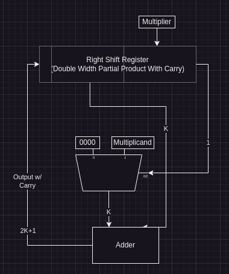

# Class 21

### Example Continued
---
### Context:
```js
a = 1010 <=> 10
x = 1011 <=> 11

k = 4 // So we need to go to p4

p0 =  0000_0000
p1 = ((0000_0000) + (1010_0000)) >> 1 = 1010_0000 >> 1 = 0101_0000
p2 = ((0101_0000) + (1010_0000)) >> 1 = 1111_0000 >> 1 = 0111_1000
p3 = ((0111_1000) + (0000_0000)) >> 1 = 0111_1000 >> 1 = 0011_1100
p4 = ((0011_1100) + (1010_0000)) >> 1 = 1101_1110 >> 1 = 0110_1110
p4 <=> 2^7 + 2^6 + 2^4 + 2^3 + 2^2 = 64 + 32 + 8 + 4 + 2 = 110
```

### Hardware
Now that we know the process, how does the hardware work?

###### Partial Product:


---

###### Final Logic:


---

### 5-bit Multiplication

```js
a = 10101 <=> 21
x = 11001 <=> 25

k = 5 // So we need to go to p5

p0 =  00000_00000
p1 = ((00000_00000) + (10101_00000)) >> 1 = 10101_00000 >> 1 = 01010_10000
p2 = ((01010_10000) + (00000_00000)) >> 1 = 01010_10000 >> 1 = 00101_01000
p3 = ((00101_01000) + (00000_00000)) >> 1 = 00101_01000 >> 1 = 00010_10100
p4 = ((00010_10100) + (10101_00000)) >> 1 = 10111_10100 >> 1 = 01011_11010
p5 = ((01011_11010) + (10101_00000)) >> 1 = 100000_11010 >> 1 = 10000_01101 = 525
```

---

### Optimization
You can put the multiplier in the last `k` bits of the product as it will get shifted out of the product as we compute.



---

### Left-Shift Multiplication

P(0) = 0
P(j+1) = 2P(j) + X(k-j-1) * A

##### Formulas (K = 4)

P(1) = X(3) * A
P(2) = 2 * (X(3) * A) + X(2) * A
P(3) = 4 * (X(3) * A) + 2 * (X(2) * A) + X(1) * A
P(4) = 8 * (X(3) * A) + 4 * (X(2) * A) + 2 * (X(1) * A) + X(0) * A
