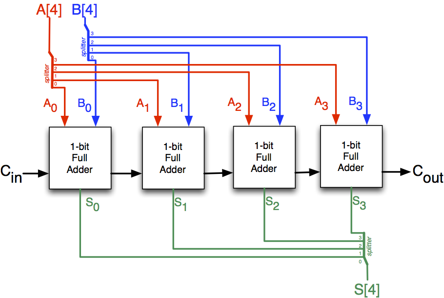
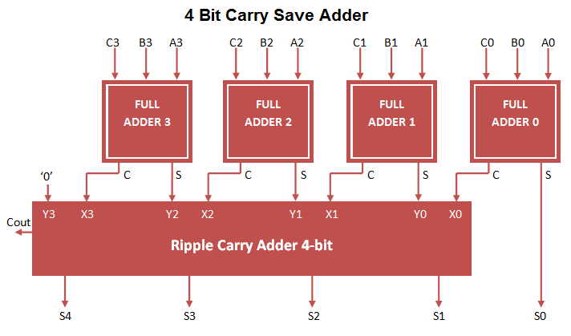

# Class 27

## More Advanced Adders

**Full Adder** → Adds 2-bits and a carry

If you are adding a 4-bit number, how many Full Adders and Half Adders are needed?
 - 3 Full Adders
 - 1 Half Adder

#### Ripple Carry Adder (RCA)

#### Carry Save Adder (CSA)

##### Example:

$7 + 4 + 8 =$ ?

|$X$|0|1|1|1|$7_{10}$|
|-|-|-|-|-|-|
|$Y$|0|1|0|0|$4_{10}$|
|$Z$|1|0|0|0|$8_{10}$|
|   |1|0|1|1|$S$|
|  0|1|0|0| |$C$|
|  1|0|0|1|1|$=19_{10}$|

---

Assume we want to add a bunch of 4-bit numbers:

|$A$|$A_3:A_0$|
|-|-|
|$B$|$B_3:B_0$|
|$C$|$C_3:C_0$|
|$D$|$D_3:D_0$|
|$E$|$E_3:E_0$|
|$F$|$F_3:F_0$|
|$G$|$G_3:G_0$|

#### CSA 1
||$A_3$|$A_2$|$A_1$|$A_0$|
|-|-|-|-|-|
||$B_3$|$B_2$|$B_1$|$B_0$|
||$C_3$|$C_2$|$C_1$|$C_0$|
||$H_3$|$H_2$|$H_1$|$H_0$|
|$I_4$|$I_3$|$I_2$|$I_1$||

#### CSA 2
||$D_3$|$D_2$|$D_1$|$D_0$|
|-|-|-|-|-|
||$E_3$|$E_2$|$E_1$|$E_0$|
||$F_3$|$F_2$|$F_1$|$F_0$|
||$J_3$|$J_2$|$J_1$|$J_0$|
|$K_4$|$K_3$|$K_2$|$K_1$||

#### CSA 3
||$J_3$|$J_2$|$J_1$|$J_0$|
|-|-|-|-|-|
||$H_3$|$H_2$|$H_1$|$H_0$|
||$G_3$|$G_2$|$G_1$|$G_0$|
||$P_3$|$P_2$|$P_1$|$P_0$|
|$M_4$|$M_3$|$M_2$|$M_1$||

#### CSA 4
||$K_4$|$K_3$|$K_2$|$K_1$|
|-|-|-|-|-|
||$I_4$|$I_3$|$I_2$|$I_1$|
||$M_4$|$M_3$|$M_2$|$M_1$|
||$N_4$|$N_3$|$N_2$|$N_1$|
|$W_5$|$W_4$|$W_3$|$W_2$||

#### CSA 5
|||$P_3$|$P_2$|$P_1$|$P_0$|
|-|-|-|-|-|-|
||$N_4$|$N_3$|$N_2$|$N_1$|
|$W_5$|$W_4$|$W_3$|$W_2$|
|$Q_5$|$Q_4$|$Q_3$|$Q_2$|$Q_1$|$Q_0$|
|$R_5$|$R_4$|$R_3$|$R_2$|||
|$S_5$|$S_4$|$S_3$|$S_2$|$S_1$|$S_0$|

### Example

|$A$|$1100$|
|-|-|
|$B$|$1011$|
|$C$|$0111$|
|$D$|$1001$|
|$E$|$0011$|
|$F$|$1010$|
|$G$|$1111$|

#### CSA 1
|$A$||$1$|$1$|$0$|$0$|
|-|-|-|-|-|-|
|$B$||$1$|$0$|$1$|$1$|
|$C$||$0$|$1$|$1$|$1$|
|$H$||$0$|$0$|$0$|$0$|
|$I$|$1$|$1$|$1$|$1$||

#### CSA 2
|$D$||$1$|$0$|$0$|$1$|
|-|-|-|-|-|-|
|$E$||$0$|$0$|$1$|$1$|
|$F$||$1$|$0$|$1$|$0$|
|$J$||$0$|$0$|$0$|$0$|
|$K$|$1$|$0$|$1$|$1$||

#### CSA 3
|$J$||$0$|$0$|$0$|$0$|
|-|-|-|-|-|-|
|$H$||$0$|$0$|$0$|$0$|
|$G$||$1$|$1$|$1$|$1$|
|$P$||$1$|$1$|$1$|$1$|
|$M$|$0$|$0$|$0$|$0$||

#### CSA 4
|$K$||$1$|$0$|$1$|$1$|
|-|-|-|-|-|-|
|$I$||$1$|$1$|$1$|$1$|
|$M$||$0$|$0$|$0$|$0$|
|$N$||$0$|$1$|$0$|$0$|
|$W$|$1$|$0$|$1$|$1$||

#### CSA 5
|$P$|||$1$|$1$|$1$|$1$|
|-|-|-|-|-|-|-|
|$N$||$0$|$1$|$0$|$0$||
|$W$|$1$|$0$|$1$|$1$|||
|$Q$|$1$|$0$|$1$|$0$|$1$|$1$|
|$R$|$0$|$0$|$1$|$1$|$0$||
|$S$|$1$|$1$|$0$|$1$|$1$|$1$|

## Things to further explore

 - Floating point (IEEE 754) $\pm mantissa * 2^{exponent}$
 - Double Precision/Single Prevision
 - Division

