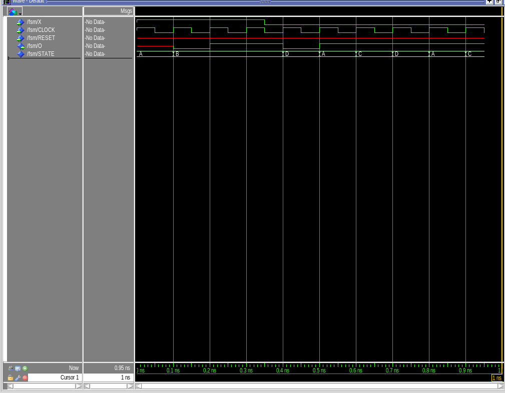

# Lab 1 Design Requirements


---

### VHDL Implementation

```vhdl
library ieee;
use ieee.std_logic_1164.all;

entity FSM is
port (
    X, CLOCK, RESET : in  std_logic;
    O               : out std_logic
);
end entity;

architecture ARCH of FSM is
type FSM_STATE is (A, B, C, D);
signal STATE : FSM_STATE;
begin
    process (CLOCK) is 
    begin
        if rising_edge(CLOCK) then
            if RESET = '1' then
                STATE <= A;
                O <= '0';
            else
                case STATE is
                    when A =>
                        if X = '0' then
                            O <= '1';
                            STATE <= C;
                        else
                            O <= '0';
                            STATE <= B;
                        end if;
                    when B =>
                        if X = '0' then
                            O <= '0';
                            STATE <= D;
                        else
                            O <= '1';
                            STATE <= B; -- Not really needed but feels nice to leave in for symetry :)
                        end if;
                    when C =>
                        if X = '0' then
                            O <= '1';
                            STATE <= D;
                        else
                            O <= '1';
                            STATE <= C; -- Same here
                        end if;
                    when D =>
                        if X = '0' then
                            O <= '1';
                            STATE <= A;
                        else
                            O <= '0';
                            STATE <= D; -- And here...
                        end if;
                end case;
            end if;
        end if;
    end process;
end architecture;
```

---

### ModelSim Verification



---

### Physical FPGA Verification


