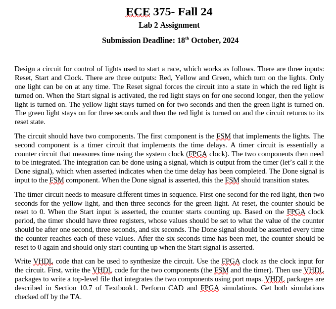
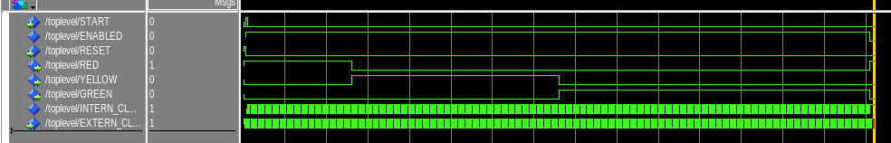

# Lab 2
### Requirements



### VHDL

##### toplevel.vhd
```vhdl
library ieee;
use ieee.std_logic_1164.all;

entity TOPLEVEL is
port (
    EXTERN_CLOCK, RESET, START : in  std_logic;
    RED, YELLOW, GREEN : out std_logic);
end entity;

architecture ARCH of TOPLEVEL is
signal INTERN_CLOCK, FSM_CLOCK, DONE, ENABLED : std_logic;

component COUNTER is
port (
     CLOCK, RESET : in  std_logic;
     DONE         : out std_logic);
end component;

component FSM is
port(
    CLOCK, RESET                : in  std_logic;
    RED, YELLOW, GREEN, ENABLED : out std_logic);
end component;

begin
    INTERN_CLOCK <= EXTERN_CLOCK and ENABLED;
	 
    process (RESET, START, DONE)
    begin
        if RESET = '1' then
            FSM_CLOCK <= '0';
        elsif START = '0' then -- Pushbuttons are active-low
            FSM_CLOCK <= '1';
        else
            FSM_CLOCK <= DONE;
        end if;
    end process;

    COUNTER_1 : COUNTER port map(
        CLOCK => INTERN_CLOCK,
        RESET => RESET,
        DONE => DONE
    );

    FSM_1: FSM port map(
        CLOCK => FSM_CLOCK,
        RESET => RESET,
        RED => RED,
        YELLOW => YELLOW,
        GREEN => GREEN,
        ENABLED => ENABLED
    );
end architecture;
```
##### counter.vhd
```vhdl
library ieee;
use ieee.std_logic_1164.all;

-- Counts every second
entity COUNTER is
port (
     CLOCK, RESET : in  std_logic;
     DONE         : out std_logic);
end entity;

architecture ARCH of COUNTER is
constant MAX_COUNT : integer := 25000000;
signal COUNT, NEXT_COUNT : integer range 0 to MAX_COUNT := 0;
begin
    process (RESET, CLOCK)
    begin
        if RESET = '1' then
            NEXT_COUNT <= 0;
        elsif rising_edge(CLOCK) then
		      COUNT <= NEXT_COUNT;
            if COUNT = MAX_COUNT then
                DONE <= '1';
                NEXT_COUNT <= 0;
            else
                DONE <= '0';
                NEXT_COUNT <= COUNT + 1;
            end if;
        end if;
    end process;
end architecture;
```
##### fsm.vhd
```vhdl
library ieee;
use ieee.std_logic_1164.all;

entity FSM is
port(
    CLOCK, RESET                : in  std_logic;
    RED, YELLOW, GREEN, ENABLED : out std_logic);
end entity;

architecture ARCH of FSM is
signal STATE, NEXT_STATE : integer range 0 to 5 := 0;
begin
    process (STATE)
    begin
        case (STATE) is
        when 0 =>
            ENABLED <= '0';
            NEXT_STATE <= 1;
            RED <= '1';
            YELLOW <= '0';
            GREEN <= '0';
        when 1 =>
            ENABLED <= '1';
            NEXT_STATE <= 2;
            RED <= '0';
            YELLOW <= '1';
            GREEN <= '0';
        when 2 =>
            ENABLED <= '1';
            NEXT_STATE <= 3;
            RED <= '0';
            YELLOW <= '1';
            GREEN <= '0';
        when 3 =>
            ENABLED <= '1';
            NEXT_STATE <= 4;
            RED <= '0';
            YELLOW <= '0';
            GREEN <= '1';
        when 4 =>
            ENABLED <= '1';
            NEXT_STATE <= 5;
            RED <= '0';
            YELLOW <= '0';
            GREEN <= '1';
        when 5 =>
            ENABLED <= '1';
            NEXT_STATE <= 0;
            RED <= '0';
            YELLOW <= '0';
            GREEN <= '1';
        end case;
    end process;

    process (RESET, CLOCK)
    begin
        if RESET = '1' then
            STATE <= 0;
        elsif rising_edge(CLOCK) then
            STATE <= NEXT_STATE;
        end if;
    end process;
end architecture;
```

### ModelSim
*Note: Changed counter max count to be simulatable*



### FPGA Verification

##### Testing Reset


#### Testing "Traffic Lights"

