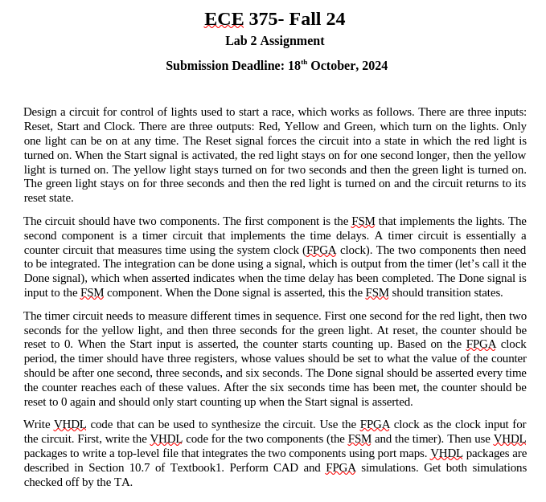
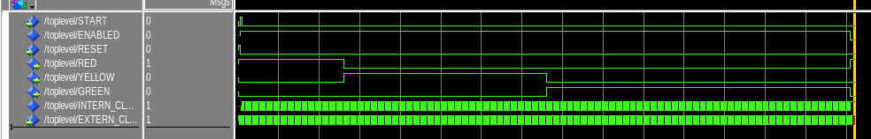

### Requirements



### VHDL

##### toplevel.vhd
```vhdl
library ieee;
use ieee.std_logic_1164.all;

entity TOPLEVEL is
port (
     EXTERN_CLOCK, RESET, START : in  std_logic;
     RED, YELLOW, GREEN  : out std_logic);
end entity;

architecture ARCH of TOPLEVEL is
signal INTERN_CLOCK, FSM_CLOCK, DONE, ENABLED : std_logic;
component COUNTER is
port (
     CLOCK, RESET       : in  std_logic;
     SWITCH_STATE, DONE : out std_logic);
end component;
component FSM is
port(
    CLOCK, RESET        : in  std_logic;
    RED, YELLOW, GREEN  : out std_logic);
end component;

begin
    process (START, DONE)
	begin
        if (START or DONE) = '1' then
            ENABLED <= START;
        end if;
    end process;

    process (EXTERN_CLOCK)
    begin
        if ENABLED = '1' then
            INTERN_CLOCK <= EXTERN_CLOCK;
        end if;
    end process;

    COUNTER_1 : COUNTER port map(
        CLOCK => INTERN_CLOCK,
        RESET => RESET,
        SWITCH_STATE => FSM_CLOCK,
        DONE => DONE
    );

    FSM_1: FSM port map(
        CLOCK => FSM_CLOCK,
        RESET => RESET,
        RED => RED,
        YELLOW => YELLOW,
        GREEN => GREEN
    );
end architecture;
```
##### counter.vhd
```vhdl
library ieee;
use ieee.std_logic_1164.all;

entity COUNTER is
port (
     CLOCK, RESET       : in  std_logic;
     SWITCH_STATE, DONE : out std_logic);
end entity;

architecture ARCH of COUNTER is
signal COUNT : integer range 0 to 300000000;
begin
    process (CLOCK)
    begin
        if rising_edge(CLOCK) then
            if RESET = '1' then
                SWITCH_STATE <= '0';
                DONE <= '0';
                COUNT <= 0;
            else
                case (COUNT) is
                when 50000000 =>
                    SWITCH_STATE <= '1';
                    DONE <= '0';
                    COUNT <= COUNT + 1;
                when 150000000 =>
                    SWITCH_STATE <= '1';
                    DONE <= '0';
                    COUNT <= COUNT + 1;
                when 300000000 =>
                    SWITCH_STATE <= '1';
                    DONE <= '1';
                    COUNT <= 0;
                when others =>
                    SWITCH_STATE <= '0';
                    DONE <= '0';
                    COUNT <= COUNT + 1;
                end case;
            end if;
        end if;
    end process;
end architecture;
```
##### fsm.vhd
```vhdl
library ieee;
use ieee.std_logic_1164.all;

entity FSM is
port(
    CLOCK, RESET        : in  std_logic;
    RED, YELLOW, GREEN  : out std_logic);
end entity;

architecture ARCH of FSM is
signal STATE, NEXT_STATE : integer range 0 to 2;
begin
    process (STATE)
    begin
        case (STATE) is
        when 0 =>
            RED <= '1';
            YELLOW <= '0';
            GREEN <= '0';
            NEXT_STATE <= 1;
        when 1 =>
            RED <= '0';
            YELLOW <= '1';
            GREEN <= '0';
            NEXT_STATE <= 2;
        when 2 =>
            RED <= '0';
            YELLOW <= '0';
            GREEN <= '1';
            NEXT_STATE <= 0;
        end case;
    end process;

    process (CLOCK)
    begin
        if rising_edge(CLOCK) then
            STATE <= NEXT_STATE;
        end if;
    end process;
end architecture;
```

### ModelSim



### FPGA Verification

