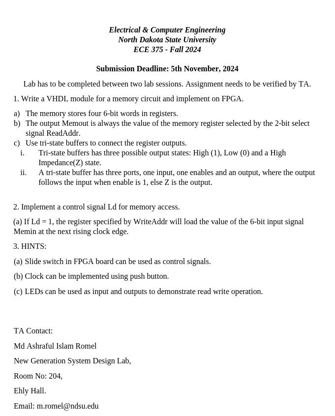
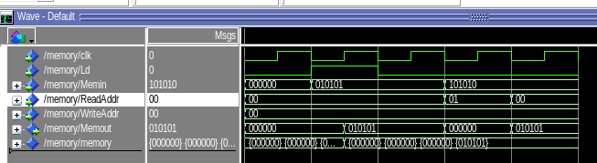

# Lab 3 
### Requirements



### VHDL Code

```vhdl
library ieee;
use ieee.std_logic_1164.all;
use ieee.std_logic_unsigned.all;

entity Memory is
    Port (
        clk       : in  std_logic;
        Ld        : in  std_logic;
        ReadAddr  : in  std_logic_vector(1 downto 0); 
        WriteAddr : in  std_logic_vector(1 downto 0); 
        Memin     : in  std_logic_vector(5 downto 0);
        Memout    : out std_logic_vector(5 downto 0)  
    );
end Memory;

architecture Arch of Memory is
type memory_array is array (3 downto 0) of std_logic_vector(5 downto 0);
signal memory : memory_array := (
    "000000",
    "000000",
    "000000",
    "000000"
);
signal out0, out1, out2, out3 : std_logic_vector(5 downto 0) := "ZZZZZZ";
begin
    -- Synchronous Write Logic
    process(clk)
    begin
        if rising_edge(clk) then
            if Ld = '1' then
                case WriteAddr is
                    when "00" => memory(0) <= Memin;
                    when "01" => memory(1) <= Memin;
                    when "10" => memory(2) <= Memin;
                    when "11" => memory(3) <= Memin;
                    when others => null;
                end case;
            end if;
        end if;
    end process;
    -- Async Read Logic using tri-buffers
    process(ReadAddr, memory)
    begin
        case ReadAddr is
            when "00" =>
                out0 <= memory(0);
                out1 <= "ZZZZZZ";
                out2 <= "ZZZZZZ";
                out3 <= "ZZZZZZ";
            when "01" =>
                out0 <= "ZZZZZZ";
                out1 <= memory(1);
                out2 <= "ZZZZZZ";
                out3 <= "ZZZZZZ";
            when "10" =>
                out0 <= "ZZZZZZ";
                out1 <= "ZZZZZZ";
                out2 <= memory(2);
                out3 <= "ZZZZZZ";
            when "11" =>
                out0 <= "ZZZZZZ";
                out1 <= "ZZZZZZ";
                out2 <= "ZZZZZZ";
                out3 <= memory(3);
            when others =>
                out0 <= "ZZZZZZ";
                out1 <= "ZZZZZZ";
                out2 <= "ZZZZZZ";
                out3 <= "ZZZZZZ";
        end case;
    end process;
	 -- Combine the output of the tri-buffers into one signal wire
    Memout <= out0 when ReadAddr = "00" else
              out1 when ReadAddr = "01" else
              out2 when ReadAddr = "10" else
              out3;
end Arch;
```

### ModelSim Verification



### FPGA Verification
Note: I didn't open this until Tuesday night so didn't see the in-person verification requirement. Sorry about that. I'll open it sooner next time...
##### Context for the demonstration:
The pink slips denote different inputs: `|WA|RA|MEM_IN|`

The `MEM_OUT` value is the right-most green LEDs.

The right-most push button is the clock and the one next to it is the `LD` value

The first video presents reading in all the values in all the registers from `0` to `3`. Each register stores `2^n` where `n` is the index of the register.


The second video presents writing different values to the first register as well as the synchronous nature of loading.


The third video just shows that you can write to more than just one register, in this case, register 01.


