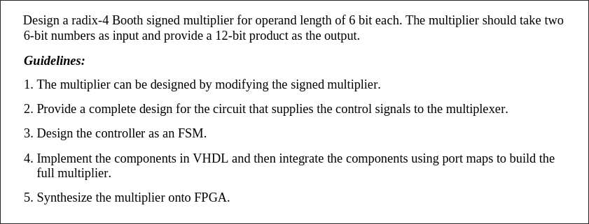
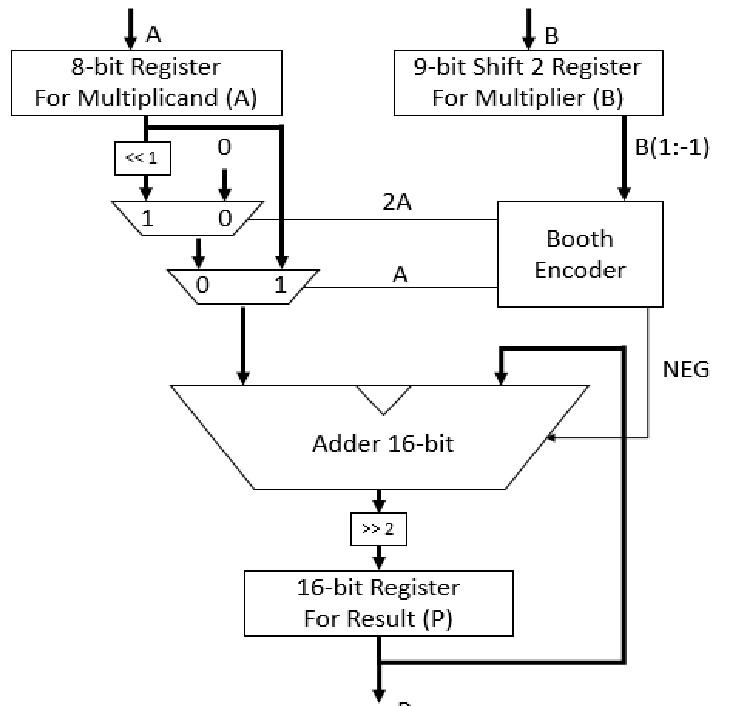
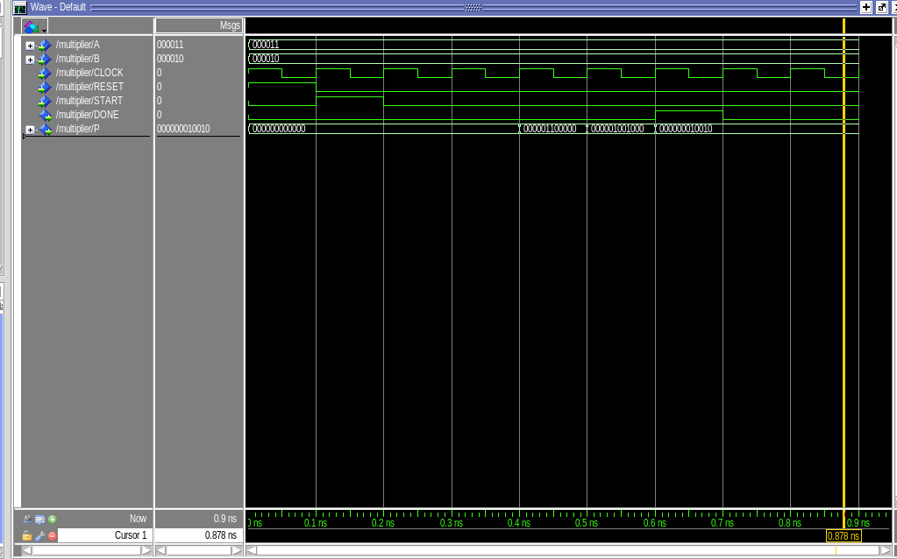

---
---
# Lab 5

## Requirements



## Control Design
Based on:  


## VHDL

#### AddSub.vhd
```vhdl
library IEEE;
use IEEE.STD_LOGIC_1164.ALL;
use IEEE.NUMERIC_STD.ALL;

entity AddSub is
    generic (
        WIDTH : integer := 6
    );
    port (
        A           : in  SIGNED(WIDTH-1 downto 0);
        B           : in  SIGNED(WIDTH-1 downto 0);
        add_sub_ctrl: in  STD_LOGIC;
        Result      : out SIGNED(WIDTH downto 0)
    );
end entity AddSub;

architecture Arch of AddSub is
    signal B_mod : SIGNED(WIDTH-1 downto 0);
    signal sum   : SIGNED(WIDTH downto 0);
begin
    B_mod <= B when add_sub_ctrl = '0' else not B + 1;

    sum <= ('0' & A) + ('0' & B_mod);

    Result <= sum;
end architecture Arch;
```

#### BoothEncoder.vhd
```vhdl
library IEEE;
use IEEE.STD_LOGIC_1164.ALL;
use IEEE.NUMERIC_STD.ALL;

entity BoothEncoder is
    port (
        Y           : in  STD_LOGIC_VECTOR(2 downto 0);
        Control_A   : out STD_LOGIC;
        Control_2A  : out STD_LOGIC;
        Control_neg : out STD_LOGIC
    );
end entity BoothEncoder;

architecture Arch of BoothEncoder is
begin
    process(Y)
    begin
        Control_A   <= '0';
        Control_2A  <= '0';
        Control_neg <= '0';
        
        case Y is
            when "000" | "111" =>
                Control_A   <= '0';
                Control_2A  <= '0';
                Control_neg <= '0';
            
            when "001" | "010" =>
                Control_A   <= '1';
                Control_2A  <= '0';
                Control_neg <= '0';
            
            when "011" =>
                Control_A   <= '0';
                Control_2A  <= '1';
                Control_neg <= '0';
            
            when "100" =>
                Control_A   <= '0';
                Control_2A  <= '1';
                Control_neg <= '1';
                
            when "101" | "110" =>
                Control_A   <= '1';
                Control_2A  <= '0';
                Control_neg <= '1';
                
            when others =>
                Control_A   <= '0';
                Control_2A  <= '0';
                Control_neg <= '0';
        end case;
    end process;
end architecture Arch;
```

#### Multiplier.vhd
```vhdl
library IEEE;
use IEEE.STD_LOGIC_1164.ALL;
use IEEE.NUMERIC_STD.ALL;

entity Multiplier is
    Port (
        CLOCK    : in  STD_LOGIC;
        RESET    : in  STD_LOGIC;
        START    : in  STD_LOGIC;
        A        : in  SIGNED(5 downto 0);
        B        : in  SIGNED(5 downto 0);
        P        : out SIGNED(11 downto 0);
        DONE     : out STD_LOGIC
    );
end entity Multiplier;

architecture Arch of Multiplier is
    type state_type is (Init, Round1, Round2, Round3, Round4, Finished);
    signal current_state, next_state : state_type;

    signal multiplicand    : SIGNED(5 downto 0);
    signal multiplier      : SIGNED(6 downto 0);
    signal partial_product : SIGNED(11 downto 0) := (others => '0');
    signal add_sub_in      : SIGNED(11 downto 0);
    signal add_result      : SIGNED(12 downto 0);
    signal control_A       : STD_LOGIC;
    signal control_2A      : STD_LOGIC;
    signal control_neg     : STD_LOGIC;

    component AddSub is
        generic (WIDTH : integer := 6);
        port (
            A            : in  SIGNED(WIDTH-1 downto 0);
            B            : in  SIGNED(WIDTH-1 downto 0);
            add_sub_ctrl : in  STD_LOGIC;
            Result       : out SIGNED(WIDTH downto 0)
        );
    end component;

    component BoothEncoder is
        port (
            Y           : in  STD_LOGIC_VECTOR(2 downto 0);
            Control_A   : out STD_LOGIC;
            Control_2A  : out STD_LOGIC;
            Control_neg : out STD_LOGIC
        );
    end component;

begin
    process(CLOCK, RESET)
    begin
        if RESET = '1' then
            current_state <= Init;
        else
            current_state <= next_state;
        end if;
    end process;

    process(CLOCK, RESET)
    begin
        if RESET = '1' then
            next_state <= Init;
        elsif rising_edge(CLOCK) then
            case current_state is
                when Init =>
                    if START = '1' then
                        next_state <= Round1;
                        multiplicand <= A;
                        multiplier <= B & '0';
                        partial_product <= (others => '0');
                    
                        if control_2A = '1' then
                            add_sub_in <= multiplicand(4 downto 0) & "0000000";
                        elsif control_A = '1' then
                            add_sub_in <= multiplicand & "000000";
                        else
                            add_sub_in <= (others => '0');
                        end if;
                    else
                        next_state <= Init;
                    end if;
                when Round1 =>
                    next_state <= Round2;

                    partial_product <= add_result(12) & add_result(12 downto 2);
                    multiplier <= "00" & multiplier(6 downto 2);
                    
                    if control_2A = '1' then
                        add_sub_in <= multiplicand(4 downto 0) & "0000000";
                    elsif control_A = '1' then
                        add_sub_in <= multiplicand & "000000";
                    else
                        add_sub_in <= (others => '0');
                    end if;
                when Round2 =>
                    next_state <= Round3;

                    partial_product <= add_result(12) & add_result(12 downto 2);
                    multiplier <= "00" & multiplier(6 downto 2);
                    
                    if control_2A = '1' then
                        add_sub_in <= multiplicand(4 downto 0) & "0000000";
                    elsif control_A = '1' then
                        add_sub_in <= multiplicand & "000000";
                    else
                        add_sub_in <= (others => '0');
                    end if;
                when Round3 =>
                    next_state <= Round4;

                    partial_product <= add_result(12) & add_result(12 downto 2);
                    multiplier <= "00" & multiplier(6 downto 2);
                    
                    if control_2A = '1' then
                        add_sub_in <= multiplicand(4 downto 0) & "0000000";
                    elsif control_A = '1' then
                        add_sub_in <= multiplicand & "000000";
                    else
                        add_sub_in <= (others => '0');
                    end if;
                when Round4 =>
                    next_state <= Finished;

                    partial_product <= add_result(12) & add_result(12 downto 2);
                    multiplier <= "00" & multiplier(6 downto 2);
                when others =>
                    next_state <= Init;
            end case;
        end if;
    end process;

    ADD_SUB : AddSub
        generic map(WIDTH => 12)
        port map(
            A            => add_sub_in,
            B            => partial_product,
            add_sub_ctrl => control_neg,
            Result       => add_result
        );
    
    BOOTH_ENCODER : BoothEncoder
        generic map(WIDTH => 6)
        port map(
            Y => std_logic_vector(multiplier(2 downto 0)),
            Control_A => control_A,
            Control_2A => control_2A,
            Control_neg => control_neg
        );

    P    <= partial_product(11 downto 0);
    DONE <= '1' when current_state = Finished else '0';

end architecture;
```

## ModelSim



 > Note: This doesn't fully work. Not sure why.
