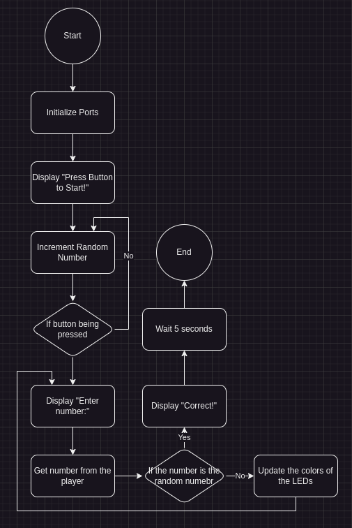

# Homework 5

## 1. The Lock
This project will be an implementation of a keypad controlled lock that will take in four numbers and if they are correct, then it will "open" the lock for two seconds and then "close."

##### The flowchart:


##### The code:
```c
#pragma warning disable 520,1385
#include "piclib.h" // You can view this at https://github.com/MrGeoTech/School/blob/master/ECE%20376/Projects/testc/piclib.h

char correct_keycode[4] = { '0', '0', '0', '0' };

void get_correct_keycode();
void change_keycode();

int main() {
    lcd_init();

    lcd_send(CONTROL_ON_NOCURSOR);
    lcd_append_all("Initializing... Please wait");
    lcd_goto(0, 0);

    // Make sure the door is locked
    rotate_full(&PORTC, 1000, 0);

    lcd_send(CLEAR);
    
    while (1) {
        get_correct_keycode();

        lcd_send(CONTROL_ON_NOCURSOR);
        lcd_send(CLEAR);
        lcd_append_all("Correct!        Opening now...");

        rotate_full(&PORTC, 100, 0);
        wait(2000);
        reverse_full(&PORTC, 100, 0);

        if (read_keypad(&PORTC) != '#') continue;
        change_keycode();
    }

    return 0;
}

void get_user_input(char *code) {
    unsigned char length = 0;

    while (length < 4) {
        char key = 0;
        while (!key) key = read_keypad(&PORTC);
        while (read_keypad(&PORTC));

        if (key == '*') {
            if (length) length--;
            lcd_goto(1, length);
            lcd_append(' ');
            lcd_goto(1, length);
            code[length] = 0;
        } else {
            if (length > 3) continue;
            lcd_append(key);
            code[length] = key;
            length++;
        }
    }
}

// Blocks until the user inputs the correct code
void get_correct_keycode() {
    char current_keycode[4];

    while (1) { // In any other context, I would make this a for loop but since speed is king, infinite loops babbbbyyyyyy!!
        lcd_send(CONTROL_ON_CURSOR_BLINK);
        lcd_send(CLEAR);
        lcd_append_all("Enter code:");
        lcd_goto(1, 0);
        while (read_keypad(&PORTC));
        wait(500);

        get_user_input(current_keycode);

        if (
            current_keycode[0] == correct_keycode[0] &&
            current_keycode[1] == correct_keycode[1] &&
            current_keycode[2] == correct_keycode[2] &&
            current_keycode[3] == correct_keycode[3]
        ) break;

        lcd_send(CLEAR);
        lcd_send(CONTROL_ON_NOCURSOR);
        lcd_append_all("Incorrect code! Try again");
        wait(2000);
    }
}

void change_keycode() {
    char new_keycode[4];

    while (1) {
        lcd_send(CLEAR);
        lcd_append_all("Enter new code:");
        lcd_send(CONTROL_ON_CURSOR_BLINK);
        lcd_goto(1, 0);

        get_user_input(new_keycode);

        lcd_send(CLEAR);
        lcd_append_all("Confirm code:");
        lcd_goto(1, 0);

        char confirm_keycode[4];
        get_user_input(confirm_keycode);

        if (
            new_keycode[0] == confirm_keycode[0] && 
            new_keycode[1] == confirm_keycode[1] && 
            new_keycode[2] == confirm_keycode[2] && 
            new_keycode[3] == confirm_keycode[3]
        ) break;

        lcd_send(CLEAR);
        lcd_send(CONTROL_ON_NOCURSOR);
        lcd_append_all("Codes mismatch! Try again!");
        wait(2000);
    }

    correct_keycode[0] = new_keycode[0];
    correct_keycode[1] = new_keycode[1];
    correct_keycode[2] = new_keycode[2];
    correct_keycode[3] = new_keycode[3];
}
```

##### Demonstrations

Note: The gifs may take a second to load


## 2. Warmer Colder

The player will be prompted to enter a number between 0 and 255. The LEDs will then display, using color, how close the number they entered is to some randomly generated number. Once the player enters the correct number, they win and it resets.

##### The flowchart:



##### The code:

```c
#pragma warning disable 520,1385
#include "piclib.h" // You can view this at https://github.com/MrGeoTech/School/blob/master/ECE%20376/Projects/testc/piclib.h

unsigned char random_number = 0;

unsigned char get_user_input();

int main() {
    TRISB = 0xFF;
    lcd_init();

    //lcd_send(CONTROL_ON_NOCURSOR);
    //lcd_append_all("Press button to start!");
    //while (!PORTB) random_number++;
    //while (PORTB) random_number++;
    //wait(250);

    unsigned char input = get_user_input();
    while (input != random_number) {
        lcd_send(CLEAR);
        lcd_send(CONTROL_ON_NOCURSOR);
        lcd_append_all("Close! Try again");
        lcd_goto(1, 0);
        lcd_append_int(input, 3, 0);

        unsigned char green = (input - random_number) - 128;
        if (green & 0x80) green = -green;
        green <<= 1;

        neopixel_set(255 - green, green, 0);

        wait(2000);

        input = get_user_input();
    }

    lcd_send(CLEAR);
    lcd_send(CONTROL_ON_NOCURSOR);
    lcd_append_all("  You got it!   Congratulations!");
    wait(5000);
    return 0;
}


unsigned char get_user_input() {
    unsigned char length = 0;
    char digits[3] = {0, 0, 0};

    lcd_send(CLEAR);
    lcd_append_all("Enter number:");
    lcd_send(CONTROL_ON_CURSOR_BLINK);
    lcd_goto(1, 0);

    while (1) {
        char key = 0;
        while (!key) key = read_keypad(&PORTC);
        while (read_keypad(&PORTC));

        if (key == '*') {
            if (length) length--;
            lcd_goto(1, length);
            lcd_append(' ');
            lcd_goto(1, length);
            digits[length] = 0;
        } else if (key == '#') {
            switch (length) {
                case 1: return digits[0] - '0';
                case 2: return (digits[0] - '0') * 10 + (digits[1] - '0');
                case 3: return (digits[0] - '0') * 100 + (digits[1] - '0') * 10 + (digits[2] - '0');
                default:;
            }
        } else {
            if (length > 2) continue;
            lcd_append(key);
            digits[length] = key;
            length++;
        }
    }
}
```

##### Demonstration


