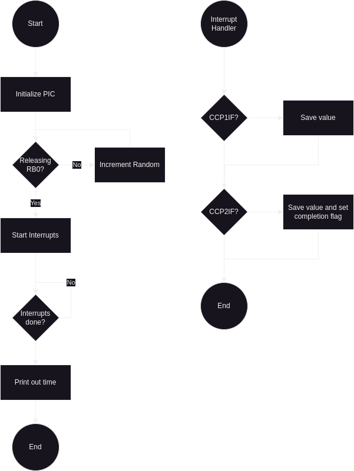

# Homework 10

### Questions 1-4

1.




2.

```c
#pragma warning disable 520,1385,1311,1510,1518,2053
#include "piclib.h"

u16_t time = 0;
u32_t capture1_time = 0;
u32_t capture2_time = 0;
u8_t capture2_flag = 0;

void __interrupt() interrupt_handler() {
    if (TMR1IF) {
        time++;
        TMR1IF = 0;
    }

    // PORTA turned on
    if (CCP1IF) {
        capture1_time = ((u32_t)time << 16) | ((u32_t)CCPR1H << 8) | CCPR1L;
        CCP1IF = 0;
    }

    // RB0 pressed
    if (CCP2IF) {
        capture2_time = ((u32_t)time << 16) | ((u32_t)CCPR2H << 8) | CCPR2L;
        capture2_flag = 1;
        CCP2IF = 0;
    }

    timers_end();
}

int main() {
    lcd_init();
    u8_t random = 0;

    TRISA = 0x00;
    TRISB = 0x01;
    TRISC = 0x06;

    TMR1CS = 0;
    T1CON = 0x81;
    TMR1ON = 1;
    TMR1IE = 1;
    TMR1IP = 1;
    TMR1H = 0x00;
    TMR1L = 0x00;

    CCP1CON = 0x05;
    CCP1IE = 1;
    CCP2CON = 0x05;
    CCP2IE = 1;

    while (!RB0) random++;
    while (RB0) random++;
    
    timers_enable();
    PORTA = 0x00;
    capture2_flag = 0;

    wait(((u16_t) (random % 3)) * 1000 + 4000);

    PORTA = 0xFF;

    while (!capture2_flag);

    u32_t reflex_time = capture2_time - capture1_time;
    lcd_append_all("Reflex time:");
    lcd_goto(1, 0);
    lcd_append_int(reflex_time, 9, 7);

    timers_disable();
    while(1);
}
```

3.


4.

- Times: \[0.2446, 0.1999, 0.1890, 0.247]
- Mean: 0.2201
- Standard Deviation: 0.029995
- 90% Confidence Interval: +- 11.2%

### Questions 5-9

5.

```c
#pragma warning disable 520,1385,1311,1510,1518,2053
#include "piclib.h"

#define E4 15169
#define F4 14317

u8_t playing;
u16_t note;

void __interrupt() interrupt_handler() {
    if (CCP1IF) {
        if (playing) RC2 ^= 1;
        CCPR1 += note;
        CCP1IF = 0;
    }
}

void play(u16_t new_note, u16_t milliseconds) {
    note = new_note;
    playing = 1;
    wait(milliseconds);
    playing = 0;
}

int main() {
    TRISC = 0x04;
    PORTC = 0x00;

    TMR1CS = 0;
    T1CON = 0x81;
    TMR1ON = 1;
    TMR1IE = 1;
    TMR1IP = 1;

    CCP1CON = 0x0A;
    CCP1IE = 1;
    CCPR1 = 0;

    timers_enable();
    while (1) {
        play(E4, 500);
        wait(200);
        play(F4, 500);
        wait(1000);
    }
}
```

6.

```c
#pragma warning disable 520,1385,1311,1510,1518,2053
#include "piclib.h"

#define E4 15169
#define F4 14317

u8_t playing;
u16_t note;

void __interrupt() interrupt_handler() {
    if (CCP1IF) {
        if (playing) RC2 ^= 1;
        CCPR1 += note;
        CCP1IF = 0;
    }
}

void play(u16_t new_note, u16_t milliseconds) {
    note = new_note;
    playing = 1;
    wait(milliseconds);
    playing = 0;
}

int main() {
    TRISB = 0x01;
    TRISC = 0x00;
    PORTC = 0x00;

    TMR1CS = 0;
    T1CON = 0x81;
    TMR1ON = 1;
    TMR1IE = 1;
    TMR1IP = 1;

    CCP1CON = 0x0A;
    CCP1IE = 1;
    CCPR1 = 0;

    timers_enable();
    while (1) {
        while (!RB0);
        while (RB0);

        play(E4, 500);
        wait(200);
        if (TMR1 & 1)
            play(E4, 500);
        else
            play(F4, 500);
        wait(1000);
    }
}
```

7.
```c
#pragma warning disable 520,1385,1311,1510,1518,2053
#include "piclib.h"

#define E4 15169
#define F4 14317

u8_t playing;
u16_t note;

void __interrupt() interrupt_handler() {
    if (CCP1IF) {
        if (playing) RC2 ^= 1;
        CCPR1 += note;
        CCP1IF = 0;
    }
}

void play(u16_t new_note, u16_t milliseconds) {
    note = new_note;
    playing = 1;
    wait(milliseconds);
    playing = 0;
}

int main() {
    TRISB = 0x03;
    PORTB = 0x00;

    TRISC = 0x00;
    PORTC = 0x00;

    TMR1CS = 0;
    T1CON = 0x81;
    TMR1ON = 1;
    TMR1IE = 1;
    TMR1IP = 1;

    CCP1CON = 0x0A;
    CCP1IE = 1;
    CCPR1 = 0;

    timers_enable();
    u8_t right = 0;
    u8_t wrong = 0;
    while (1) {
        while (!RB0);
        while (RB0);

        u8_t is_same = TMR1 & 1;

        play(E4, 500);
        wait(200);
        if (is_same)
            play(E4, 500);
        else
            play(F4, 500);
        wait(1000);

        while (!PORTB);
        if ((RB0 && is_same) || (RB1 && !is_same))
            right++;
        else
            wrong++;
        while (PORTB);

        lcd_append_all("Right: ");
        lcd_append_int(right, 1, 0);
        lcd_goto(1, 0);
        lcd_append_all("Wrong: ");
        lcd_append_int(wrong, 1, 0);
    }
}
```

8 & 9.
```c
#pragma warning disable 520,1385,1311,1510,1518,2053
#include "piclib.h"

#define E4 15169
#define E4_LOW 15184 //
#define F4 14317

u8_t playing;
u16_t note;

void __interrupt() interrupt_handler() {
    if (CCP1IF) {
        if (playing) RC2 ^= 1;
        CCPR1 += note;
        CCP1IF = 0;
    }
}

void play(u16_t new_note, u16_t milliseconds) {
    note = new_note;
    playing = 1;
    wait(milliseconds);
    playing = 0;
}

int main() {
    TRISB = 0x03;
    PORTB = 0x00;

    TRISC = 0x00;
    PORTC = 0x00;

    TMR1CS = 0;
    T1CON = 0x81;
    TMR1ON = 1;
    TMR1IE = 1;
    TMR1IP = 1;

    CCP1CON = 0x0A;
    CCP1IE = 1;
    CCPR1 = 0;

    timers_enable();
    u8_t right = 0;
    u8_t wrong = 0;
    while (1) {
        while (!RB0);
        while (RB0);

        u8_t is_same = TMR1 & 1;

        play(E4, 500);
        wait(200);
        if (is_same)
            play(E4, 500);
        else
            play(E4_LOW, 500); //
        wait(1000);

        while (!PORTB);
        if ((RB0 && is_same) || (RB1 && !is_same))
            right++;
        else
            wrong++;
        while (PORTB);

        lcd_append_all("Right: ");
        lcd_append_int(right, 1, 0);
        lcd_goto(1, 0);
        lcd_append_all("Wrong: ");
        lcd_append_int(wrong, 1, 0);
    }
}
```

- Right => 6
- Wrong => 5

Number of Bins: `2`

| Bin   | Theoretical Probability (p) | Expected Frequency (np) | Actual Frequency (N) | Chi-Squared Test |
| ----- | --------------------------- | ----------------------- | -------------------- | ---------------- |
| Right | 1                           | 11                      | 6                    | 2.3              |
| Wrong | 0                           | 0                       | 5                    | 0 (undefined)    |
| Total | 1                           | 11                      | 11                   | 2.3              |
Probability of Rejection: `68.336%`(Guessing)
