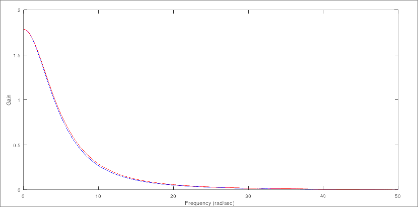
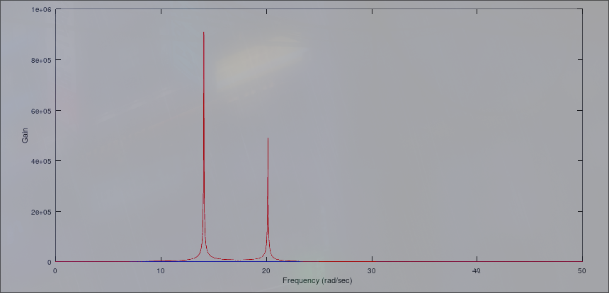
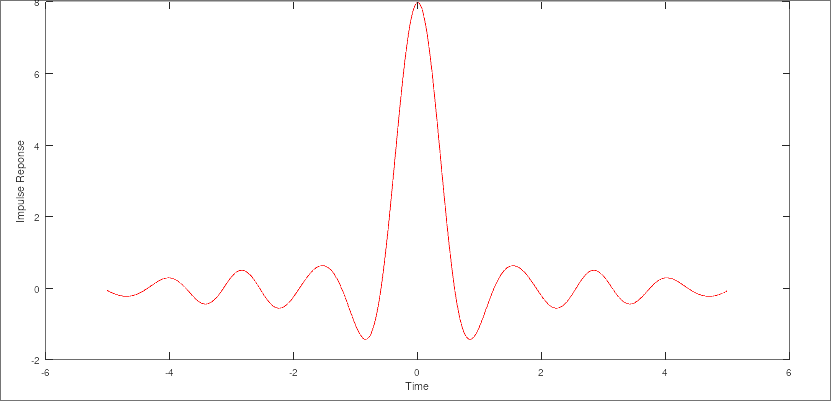
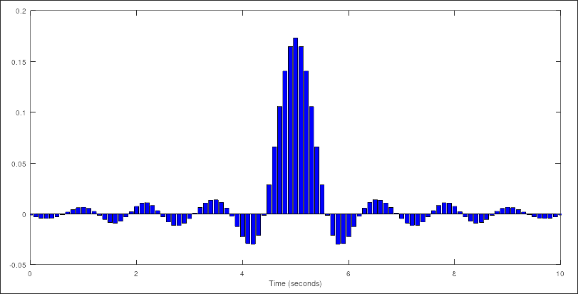
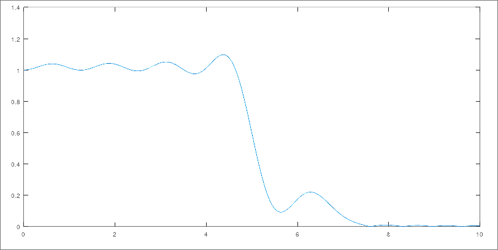

# Homework 11

### Question 1

a. $\frac{dy^2}{dt^2}+7\frac{dy}{dt}+18y=8\frac{dx}{dt}+3x$

b. $y(t)=6e^{-\frac{7}{2}}sin({\sqrt{\frac{23}{4}}t}) - 7.5e^{-\frac{7}{2}}cos({\sqrt{\frac{23}{4}}t})$

### Question 2

a. $y_{k+2}-1.3y_{k+1}+0.36y_k=\frac{x_{k+1}+x_k}{4}$

b. $-0.1949cos(4t)-24.9987sin(4t)$

c. $-\frac{17.1}{z-0.9}+\frac{0.93333\dots }{z-0.4}+\frac{50}{3\left(z-1\right)}$

### Question 3

$G(z)=(\frac{0.0005}{(z-0.96)(z-0.93)(z-0.9)})$



### Question 4

$G(z)=(\frac{-1.13-0.4i}{(z-0.96)(z-0.98-0.2i)(z-0.99-0.14i)})$



### Question 5
```c
typedef float f32_t; // Assuming complied on modern system
typedef struct Complex {
    f32_t real;
    f32_t imag;
} complex_t;

complex_t add(complex_t a, complex_t b) {
    return (complex_t) { a.real + b.real, a.imag + b.imag};
}
complex_t sub(complex_t a, complex_t b) {
    return (complex_t) { a.real - b.real, a.imag - b.imag};
}
complex_t mul(complex_t a, complex_t b) {
    return (complex_t) {
        a.real * b.real + a.imag * b.imag,
        a.real * b.imag + a.imag * b.real
    };
}
complex_t div(complex_t a, complex_t b) {
    return (complex_t) {
        (a.real * b.real + a.imag * b.imag) / (b.real * b.real + b.imag * b.imag),
        (a.real * b.imag - a.imag * b.real) / (b.real * b.real + b.imag * b.imag)
    };
}

complex_t filter(complex_t z) {
    complex_t top = { -1.13, -0.4 };
    complex_t btm_1 = { z.real - 0.96, z.imag};
    complex_t btm_2 = { z.real - 0.98, z.imag - 0.2};
    complex_t btm_3 = { z.real - 0.99, z.imag - 0.14};
    complex_t btm = mul(mul(btm_1, btm_2), btm_3);
    return div(top, btm);
}
```

### Question 6

$G(s)=0.25LPF(7\frac{rad}{sec})+1.25LPF(5\frac{rad}{sec})-0.5LPF(3\frac{rad}{sec})$

$H(t)=\frac{sin(7t)}{4t}+\frac{5sin(5t)}{4t}-\frac{sin(3t)}{2t}$

---
##### Impulse Reponse Graph


### Question 7

**Sample Rate** - $T = 0.01$

**Window** - $[-5, 5]$



### Question 8


