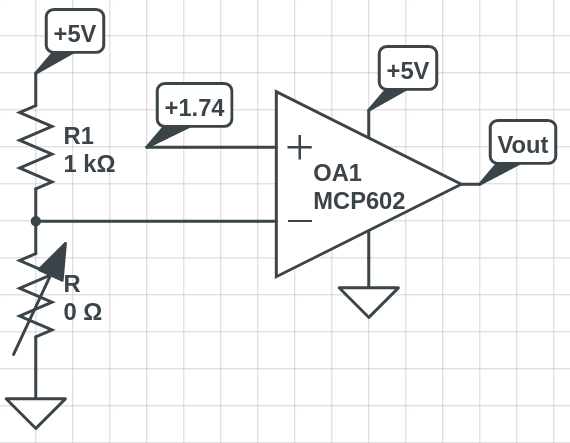
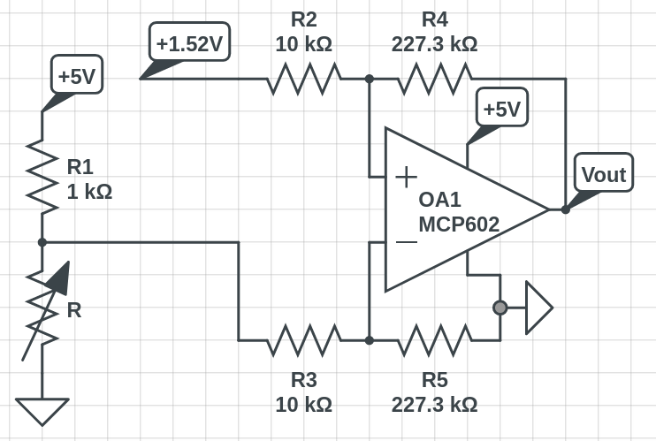
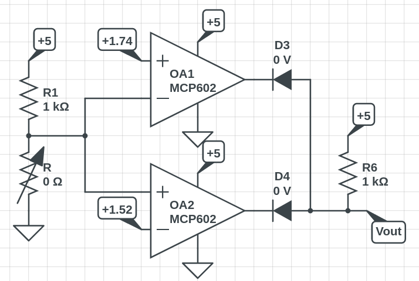
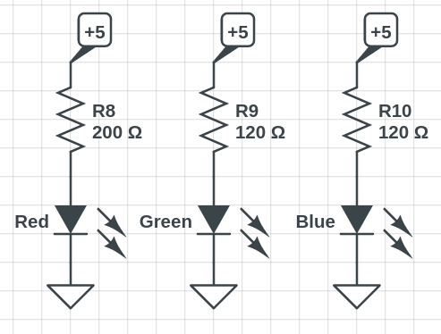
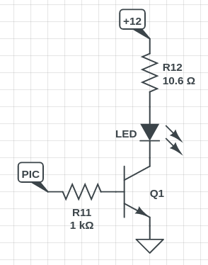
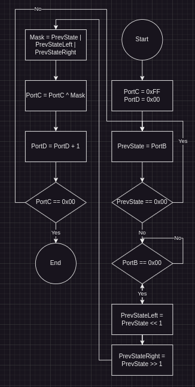

Worked on with Dannalyn

1.

R = 1000 * exp( 3905/(40+273) - 3905/298 )

R = 533.66

V = 1.74 V


 
2.

R = 1000 * exp( 3905/(45+273) - 3905/298 )

R45 = 438.61

R40 = 533.66

Von = 1.52 (45)

Voff = 1.74 (40)

gain = (5-0)\(1.74-1.52)

gain = 22.73



3.

R40 = 533.66

R45 = 438.61

Von = 1.74 (40)

Voff = 1.52 (45)



4.



5.

Power Supply Voltage: 12V

Rc = (12-6.5-0.2) / .5 = 10.6

300 * Ib > 500mA

Ib > 5/3mA

Therefore, 1.66mA < Ib < 25mA, so Ib = 4.3mA or Rb = 1k



6.

Instructions per toggle = 10,000,000 / (2 * 207.652) = 24079

N = 10 * A * B + 5 * A + 19 = 24079

A = 12, B = 200

```asm
#include <p18f4620.inc>

; Variables
CNT0 EQU 1
CNT1 EQU 2

; Program
	org 0x800
	call Init
Loop:
	incf PORTC,F
	call Wait
	goto Loop
; --- Subroutines ---
Init:
	clrf TRISA
	clrf TRISB
	clrf TRISC
	clrf TRISD
	clrf TRISE
	movlw 0x0F
	movwf ADCON1 ;everyone is binary
	return
Wait:
	movlw 7 ; A
	movwf CNT1
W1:
		movlw 216 ; B
		movwf CNT0
W0:
			nop ; 10 clocks
			nop
			nop
			nop
			nop
			nop
			nop
			decfsz CNT0, F
			goto W0
		decfsz CNT1, F
		goto W1
	nop
	nop
	nop
	nop
	nop
	nop
	nop
	nop
	nop
	nop
	return
```

7.



```asm
#include <p18f4620.inc>
    
; Variables
PREV_STATE       EQU 1
PREV_STATE_LEFT  EQU 2
PREV_STATE_RIGHT EQU 3

    ; Program
    org 0x800
    
    movlw 0xFF
    movwf TRISB
    clrf  TRISC
    clrf  TRISD

    movwf PORTC
    clrf  PORTD

    movlw 0x0F
    movwf ADCON1

Start:
    movff  PORTB, PREV_STATE
    movlw  0x00
    cpfsgt PREV_STATE
    goto   Start
WhileDown:
    cpfsgt PORTB
    goto   UpdateOutput
    goto   WhileDown
UpdateOutput:
    movff  PREV_STATE, PREV_STATE_LEFT
    movff  PREV_STATE, PREV_STATE_RIGHT
    rlcf   PREV_STATE_LEFT, F
    rrcf   PREV_STATE_RIGHT, F ; Rotate PREV_STATE both left and right
    movf   PREV_STATE, W
    iorwf  PREV_STATE_LEFT, W
    iorwf  PREV_STATE_RIGHT, W ; Logical OR all PREV_STATEs together
    xorwf  PORTC, F            ; Logical XOR PORTC with W (the mask)
    incf   PORTD
    movlw  0x00
    cpfseq PORTC
    goto   Start
    
    clrf  PORTC
    clrf  PORTD
    end
```

See Images/HW03_V0.mp4 if video doesn't load

