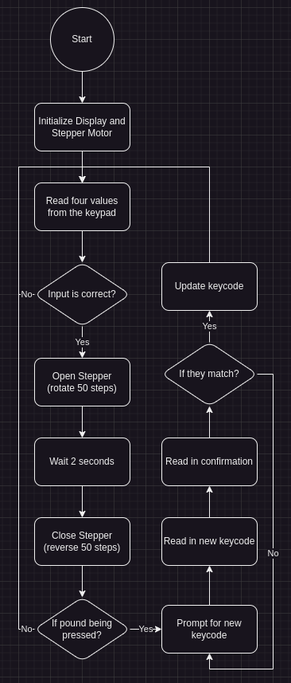

## 1. The Lock
This project will be an implementation of a keypad controlled lock that will take in four numbers and if they are correct, then it will "open" the lock for two seconds and then "close."

The flowchart:


The code:
```c
#pragma warning disable 520,1385
#include "piclib.h"

char correct_keycode[4] = { '0', '0', '0', '0' };

void get_correct_keycode();
void change_keycode();

int main() {
    lcd_init();

    lcd_send(CONTROL_ON_NOCURSOR);
    lcd_append_all("Initializing... Please wait");
    lcd_goto(0, 0);

    // Make sure the door is locked
    rotate_full(&PORTC, 1000, 0);

    lcd_send(CLEAR);
    
    while (1) {
        get_correct_keycode();

        lcd_send(CONTROL_ON_NOCURSOR);
        lcd_send(CLEAR);
        lcd_append_all("Correct!        Opening now...");

        rotate_full(&PORTC, 100, 0);
        wait(2000);
        reverse_full(&PORTC, 100, 0);

        if (read_keypad(&PORTC) != '#') continue;
        change_keycode();
    }

    return 0;
}

// Blocks until the user inputs the correct code
void get_correct_keycode() {
    char current_keycode[4];

    while (1) { // In any other context, I would make this a for loop but since speed is king, infinite loops babbbbyyyyyy!!
        lcd_send(CONTROL_ON_CURSOR_BLINK);
        lcd_send(CLEAR);
        lcd_append_all("Enter code:");
        lcd_goto(1, 0);

        // It's small enough that just hard-coding it isn't too hard
        char key = read_keypad(&PORTC);
        while (!key) key = read_keypad(&PORTC);
        while (read_keypad(&PORTC));
        current_keycode[0] = key;
        lcd_append(key);
        key = read_keypad(&PORTC);
        while (!key) key = read_keypad(&PORTC);
        while (read_keypad(&PORTC));
        current_keycode[1] = key;
        lcd_append(key);
        key = read_keypad(&PORTC);
        while (!key) key = read_keypad(&PORTC);
        while (read_keypad(&PORTC));
        current_keycode[2] = key;
        lcd_append(key);
        key = read_keypad(&PORTC);
        while (!key) key = read_keypad(&PORTC);
        while (read_keypad(&PORTC));
        current_keycode[3] = key;
        lcd_append(key);

        if (
            current_keycode[0] == correct_keycode[0] &&
            current_keycode[1] == correct_keycode[1] &&
            current_keycode[2] == correct_keycode[2] &&
            current_keycode[3] == correct_keycode[3]
        ) break;

        lcd_send(CLEAR);
        lcd_send(CONTROL_ON_NOCURSOR);
        lcd_append_all("Incorrect code! Try again");
        wait(2000);
    }
}

void change_keycode() {
    char new_keycode[4];

    while (1) {
        lcd_send(CLEAR);
        lcd_append_all("Enter new code:");
        lcd_send(CONTROL_ON_CURSOR_BLINK);
        lcd_goto(1, 0);

        char key = read_keypad(&PORTC);
        while (!key) key = read_keypad(&PORTC);
        while (read_keypad(&PORTC));
        new_keycode[0] = key;
        lcd_append(key);
        key = read_keypad(&PORTC);
        while (!key) key = read_keypad(&PORTC);
        while (read_keypad(&PORTC));
        new_keycode[1] = key;
        lcd_append(key);
        key = read_keypad(&PORTC);
        while (!key) key = read_keypad(&PORTC);
        while (read_keypad(&PORTC));
        new_keycode[2] = key;
        lcd_append(key);
        key = read_keypad(&PORTC);
        while (!key) key = read_keypad(&PORTC);
        while (read_keypad(&PORTC));
        new_keycode[3] = key;
        lcd_append(key);

        lcd_send(CLEAR);
        lcd_append_all("Confirm code:");
        lcd_goto(1, 0);

        char is_correct = 1;

        key = read_keypad(&PORTC);
        while (!key) key = read_keypad(&PORTC);
        while (read_keypad(&PORTC));
        if (key != new_keycode[0]) is_correct = 0;
        lcd_append(key);
        key = read_keypad(&PORTC);
        while (!key) key = read_keypad(&PORTC);
        while (read_keypad(&PORTC));
        if (key != new_keycode[1]) is_correct = 0;
        lcd_append(key);
        key = read_keypad(&PORTC);
        while (!key) key = read_keypad(&PORTC);
        while (read_keypad(&PORTC));
        if (key != new_keycode[2]) is_correct = 0;
        lcd_append(key);
        key = read_keypad(&PORTC);
        while (!key) key = read_keypad(&PORTC);
        while (read_keypad(&PORTC));
        if (key != new_keycode[3]) is_correct = 0;
        lcd_append(key);

        if (is_correct) break;

        lcd_send(CLEAR);
        lcd_send(CONTROL_ON_NOCURSOR);
        lcd_append_all("Codes mismatch! Try again!");
        wait(2000);
    }

    correct_keycode[0] = new_keycode[0];
    correct_keycode[1] = new_keycode[1];
    correct_keycode[2] = new_keycode[2];
    correct_keycode[3] = new_keycode[3];
}
```