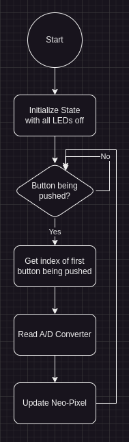

Note: This uses a self-built library called `piclib`. You can view the header file [here](https://github.com/MrGeoTech/School/blob/master/ECE%20376/Projects/testc/piclib.h) and the source file [here](https://github.com/MrGeoTech/School/blob/master/ECE%20376/Projects/testc/piclib.c)

## Questions 1-3
##### 1. The Requirements
This program will take the input of the variable resistor on the PIC board and using the A/D, change the brightness of the Neo-Pixel corresponding to the button being pushed. e.g. RB0 controls the bottom Neo-Pixel.

##### 2.a. The Flowchart



##### 2.b. The Code

```c
#pragma warning disable 520,1385
#include "piclib.h"

int main() {
    TRISB = 0xFF;
    ad_converter_init();
    wait(100);

    u8_t color_data[NEO_PIXEL_COUNT * 3];
    for (u8_t i = 0; i < NEO_PIXEL_COUNT * 3; i++) color_data[i] = 0;
    neopixel_send(color_data);

    while (1) {
        u8_t buttons = PORTB;
        if (!buttons) continue;
        
        u8_t index = 0;
        while (!(buttons & 0x01)) {
            index += 3;
            buttons >>= 1;
        }

        u8_t brightness = (u8_t) (ad_converter_read(PORTA_0) >> 2);
        color_data[index] = brightness;
        color_data[index+1] = brightness;
        color_data[index+2] = brightness;

        neopixel_send(color_data);
        wait(10);
    }

    return 0;
}
```

##### 3. Validation
Note: The GIFs may take a second to load


---
##### Question 4

```c
#pragma warning disable 520,1385
#include "piclib.h"

int main() {
    TRISB = 0x01;
    lcd_init();
    serial_init();

    i8_t DIE = 0;
    while(1) {
        while(!(PORTB & 0x01));
        while((PORTB & 0x01)) DIE = (DIE + 1) % 6;
        DIE += 1;
        lcd_goto(1,0); 
        lcd_append_int(DIE, 1, 0);
        serial_append_int(DIE, 1, 0);
        serial_newline();
    }

    return 0;
}
```

<details>
	<summary>Output Data</summary>
Bin 1:
5,1,2,5,2,1,1,2,3,6,6,5,5,6,5,1,6,3,3,1,4,2,2,2,3,6,3,4,2,3,6,5,5,3,3,4,6,2,5,3,2,2,2,3,1,6,6,4,1,1,5,1
Bin 2:
1,4,5,3,6,1,2,4,4,6,3,4,6,3,5,1,1,4,6,6,3,4,1,2,1,6,6,6,3,3,3,4,4,3,1,4,1,6,6,3,2,1,3,2,4,6,2,1,4,2,4,6
Bin 3:
2,1,1,2,3,5,3,1,4,3,6,4,4,1,4,1,6,4,1,1,1,3,6,2,3,5,5,5,6,5,2,6,5,4,5,2,2,5,4,6,3,6,5,6,2,6,5,1,1,5,6,1
Bin 4:
6,1,2,3,6,3,2,1,1,1,4,1,4,1,4,5,3,1,3,2,4,4,1,5,4,1,5,5,2,4,6,6,5,2,6,3,1,6,1,3,2,3,6,5,6,2,3,3,1,3,2,4
Bin 5:
6,1,1,4,5,6,4,6,6,2,1,6,1,1,2,5,5,5,1,5,2,1,4,2,1,6,5,1,6,6,2,6,6,1,6,2,4,4,2,6,3,2,2,6,1,1,2,2,5,1,5,4
Bin 6:
3,4,2,4,5,4,3,3,4,1,1,1,3,3,4,4,4,1,3,3,3,6,1,6,6,6,4,4,5,3,2,1,2,4,4,4,4,5,3,2,4,3,1,4,1,3,2,3,2,5,1,4
</details>

```matlab
expected_freq = length(bin_1) / 6;
% Find the frequency of n in for each bin_n
actual_freq_1 = nnz(bin_1 == 1);
actual_freq_2 = nnz(bin_2 == 2);
actual_freq_3 = nnz(bin_3 == 3);
actual_freq_4 = nnz(bin_4 == 4);
actual_freq_5 = nnz(bin_5 == 5);
actual_freq_6 = nnz(bin_6 == 6);
% Find the chi-squared value for each bin
chi_squared_1 = ((expected_freq - actual_freq_1)^2 / expected_freq);
chi_squared_2 = ((expected_freq - actual_freq_2)^2 / expected_freq);
chi_squared_3 = ((expected_freq - actual_freq_3)^2 / expected_freq);
chi_squared_4 = ((expected_freq - actual_freq_4)^2 / expected_freq);
chi_squared_5 = ((expected_freq - actual_freq_5)^2 / expected_freq);
chi_squared_6 = ((expected_freq - actual_freq_6)^2 / expected_freq);
% Compute the final chi-squared
chi_squared = chi_squared_1 + chi_squared_2 + chi_squared_3 + chi_squared_4 + chi_squared_5 + chi_squared_6;

disp(chi_squared);

% Output:
%   4.2692
```

Probability of Rejection: `48.866%`

I would say yes, this is fair dice as the probability of rejection is less than 50%

---
##### Question 5

```c
#pragma warning disable 520,1385
#include "piclib.h"

int main() {
    TRISB = 0x01;
    lcd_init();
    serial_init();

    i8_t DIE = 0, X = 0;
    while(1) {
        while(!(PORTB & 0x01));
        while(PORTB & 0x01) {
            DIE = (DIE + 1) % 6;
            X = (X + 1) % 7;
        }
        DIE = DIE + 1;
        if(X == 0) DIE = 6;

        lcd_goto(1,0); 
        lcd_append_int(DIE, 1, 0);
        serial_append_int(DIE, 1, 0);
        serial_append(',');
    }

    return 0;
}
```

<details>
	<summary>Output Data</summary>
Bin 1:
1,2,1,6,4,3,4,5,6,4,6,6,2,1,6,1,1,4,3,6,5,6,3,3,6,2,5,4,6,3,6,6,3,5,6,5,2,5,4,2,1,6,2,3,3,6,6,6,5,6,3,5
Bin 2:
1,4,5,3,6,1,2,4,4,6,3,4,6,3,5,1,1,4,6,6,3,4,1,2,1,6,6,6,3,3,3,4,4,3,1,4,1,6,6,3,2,1,3,2,4,6,2,1,4,2,4,6
Bin 3:
3,4,1,5,6,2,6,6,6,4,3,4,6,6,3,4,4,6,1,1,3,5,4,6,6,4,2,2,2,3,6,3,5,3,5,3,5,5,5,2,3,4,6,4,6,6,4,5,4,3,6,5
Bin 4:
[1,4,3,3,1,1,1,4,3,5,2,3,3,6,2,5,6,6,5,5,6,3,1,2,3,5,1,6,5,6,6,6,6,3,4,4,3,5,6,3,6,6,6,1,2,6,1,3,2,4,4,3];
Bin 5:
5,4,2,4,5,6,1,4,2,4,6,1,3,1,5,6,1,3,5,6,2,3,2,4,5,6,2,2,6,6,2,4,2,4,2,4,6,6,5,1,5,2,6,6,2,4,2,1,6,1,1,3
Bin 6:
1,5,6,5,6,6,1,1,6,6,1,6,3,2,4,6,2,5,4,5,1,3,5,4,5,3,1,3,3,5,6,2,6,2,3,6,4,1,3,4,5,2,6,6,3,1,4,1,1,4,2,6];
</details>

```matlab
expected_freq = length(bin_1) / 6;

actual_freq_1 = nnz(bin_1 == 1);
actual_freq_2 = nnz(bin_2 == 2);
actual_freq_3 = nnz(bin_3 == 3);
actual_freq_4 = nnz(bin_4 == 4);
actual_freq_5 = nnz(bin_5 == 5);
actual_freq_6 = nnz(bin_6 == 6);

chi_squared_1 = ((expected_freq - actual_freq_1)^2 / expected_freq);
chi_squared_2 = ((expected_freq - actual_freq_2)^2 / expected_freq);
chi_squared_3 = ((expected_freq - actual_freq_3)^2 / expected_freq);
chi_squared_4 = ((expected_freq - actual_freq_4)^2 / expected_freq);
chi_squared_5 = ((expected_freq - actual_freq_5)^2 / expected_freq);
chi_squared_6 = ((expected_freq - actual_freq_6)^2 / expected_freq);

chi_squared = chi_squared_1 + chi_squared_2 + chi_squared_3 + chi_squared_4 + chi_squared_5 + chi_squared_6;

disp(chi_squared);

% Output:
%   5.1538
```

Probability of Rejection: `60.260%`

I would say no, this is not a fair dice as the probability of rejection is more than 50%

---
##### Question 6

```c
#pragma warning disable 520,1385
#include "piclib.h"

int main() {
    TRISB = 0x0F;
    PORTB = 0x00;
    ad_converter_init();
    lcd_init();
    lcd_send(CONTROL_ON_NOCURSOR);

    u8_t random_num = 0;
    u16_t right, wrong = 0;
    while (1) {
        // Update LCD
        lcd_send(CLEAR);
        lcd_append_all("Right: ");
        lcd_append_int(right, 9, 0);
        lcd_goto(1, 0);
        lcd_append_all("Wrong: ");
        lcd_append_int(wrong, 9, 0);
        // Get the guess from user
        while (!PORTB) random_num = (random_num + 1) & 0x03;
        u8_t input = PORTB;
        u8_t button = 0;
        while (!(input & (0x01 << button))) button++;
        while (PORTB) random_num = (random_num + 1) & 0x03;
        // Check random number and see if it is correct
        if (button == random_num) right++; else wrong++;
    }
}
```

##### Question 7 & 8

Number of Bins: `4`

Each Bin:
- Corresponds to a single value
- Theoretical Probability: `1/4`
- Expected Frequency: `10`

| Bin   | Theoretical Probability (p) | Expected Frequency (np) | Actual Frequency (N) | Chi-Squared Test |
| ----- | --------------------------- | ----------------------- | -------------------- | ---------------- |
| 0     | 1/4                         | 10                      | 10                   | 0                |
| 1     | 1/4                         | 10                      | 12                   | 0.4              |
| 2     | 1/4                         | 10                      | 12                   | 0.4              |
| 3     | 1/4                         | 10                      | 9                    | 0.1              |
| Total | 1                           | 40                      | 43                   | 0.9              |
Probability of Rejection: `17.457%`
