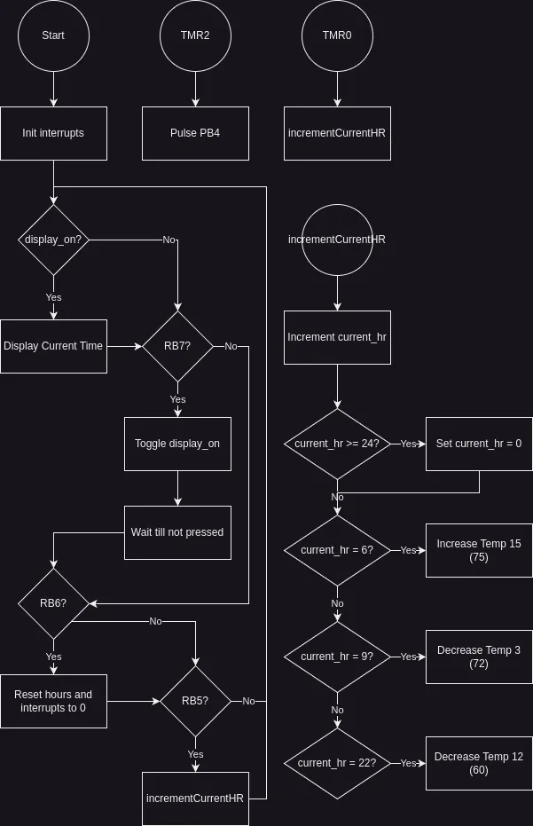

# Final Project

## Project Requirements

### Embedded System Requirements

 - Design an embedded system using your PIC board
 - Must include at least two interrupts in a meaningful way
 - Must incorporate knowledge from at least 3 different lectures
 - If based upon existing homework or sample code, add features to show off your programming skills

### System Overview

**Timed Thermostat Controller**
 - Uses system clock to determine current time
 - Uses two interrupts to measure time semi-accurately on the scale of hours (Lectures 18, 19, 20, 21)
 - Displays the current hour to the LCD (Lecture 9)
 - Uses stepper motor to control thermostat (Lecture 11)
 - Not based upon existing homework or sample code

### Software Design



### Software Implementation

##### main.c
```c
#include "piclib.h"

u8_t current_hr = 0;
u8_t display_on = 1;

void incTemp(u16_t amount) {
    reverse_full(&PORTC, 20 * amount, 0);
}

void decTemp(u16_t amount) {
    rotate_full(&PORTC, 20 * amount, 0);
}

void resetTMR0() {
    //TMR0H = 0xFE; // 2^16 - 1000 = 0xFC18 (For testing)
    //TMR0L = 0x18;
    TMR0H = 0x92; // 2^16 - 28125 = 37411 = 0x9223
    TMR0L = 0x23;
}

void __interrupt() int_handler() {
    if (TMR2IF) {
        // Toggle RB4
        PORTB ^= 0x10;
        wait_fractional(2);
        PORTB ^= 0x10;
        TMR2IF = 0;
    } else if (TMR0IF) {
        current_hr++;
        resetTMR0();
        TMR0IF = 0;
    }
}

// App that controls my thermostat based on time.
int main() {
    TRISA = 0x10;
    TRISB = 0xE0;
    TRISC = 0xFF;

    // CLOCK -> MS
    T2CON = 0xFF; // 1:16, Enable, PS = 5
    PR2 = 125; // 16 * 5 * 125 = 10,000
    TMR2IE = 1;
    TMR2IP = 1;

    // MS -> HR
    T0CON = 0xAE; // Enable, 16-bit, Pin Triggered, Prescaller Assigned, 1:128
    resetTMR0();
    TMR0IE = 1;
    TMR0IP = 1;

    PEIE = 1;
    GIE = 1;

    u8_t prev_hr = current_hr - 1;
    lcd_init();
    lcd_append_all("Current hour: ");

    while (1) {
        if (PORTB & (1 << 7)) { // RB7
            display_on = !display_on;
            lcd_send(CLEAR);
            if (display_on) {
                lcd_send(CONTROL_ON_NOCURSOR);
                lcd_append_all("Current hour: ");
            } else {
                lcd_send(CONTROL_OFF_NOCURSOR);
            }
            while (PORTB & 0x80);
            wait(100); // Poor mans debouncer
        }

        // Send full instructions incase an interrupt happens mid-instruction
        if (display_on && prev_hr != current_hr) {
            lcd_goto(1, 0);
            lcd_append_int(current_hr, 2, 0);
            prev_hr = current_hr;

            // Move motor "asynchronous" to the timing
            if (current_hr >= 24) {
                current_hr = 0;
            } else if (current_hr == 6) {
                incTemp(15);
            } else if (current_hr == 9) {
                decTemp(3);
            } else if (current_hr == 22) {
                decTemp(12);
            }
        }

        if (PORTB & (1 << 6)) { // RB6
            current_hr = 0;
            TMR2 = 0;
            resetTMR0();
            while (PORTB & 0x40);
            wait(100); // Poor mans debouncer
        }

        if (PORTB & (1 << 5)) { // RB5
            current_hr++;
            while (PORTB & 0x20);
            wait(100); // Poor mans debouncer
        }

        wait(1);
    }
}
```
##### piclib.h
```c
#include <xc.h>
// Used in the wait function to measure time
// You can set your own to make sure your PIC is perfectly timed
// To figure out the value you should use for your PIC, you can
// either use an occiliscope or hook up a speaker and adjust the
// value until if waiting 1 ms, you get 500 Hz
#ifndef LOOPS_PER_MS
#define LOOPS_PER_MS 1104
#endif

// Makes the types look similar to zigs types. This is easier to understand at a glance

typedef signed char i8_t;
typedef unsigned char u8_t;
typedef signed short i16_t;
typedef unsigned short u16_t;
typedef signed long i32_t;
typedef unsigned long u32_t;
typedef signed long long i64_t;
typedef unsigned long long u64_t;
typedef float f32_t;

/* ------ Time ------ */

// Waits for the specified time in milliseconds
void wait(u16_t milliseconds);
// Waits for LOOPS_PER_MS >> `shift` loops
void wait_fractional(u8_t shift);

/* ------ LCD ------ */

// An enum that contains all commands you can send to the LCD screen
enum LCDCommand {
    CLEAR = 0x01,
    HOME = 0x02,
    MODE_DECREMENT_NORMAL = 0x04,
    MODE_DECREMENT_SHIFTED,
    MODE_INCREMENT_NORMAL,
    MODE_INCREMENT_SHIFTED,
    CONTROL_OFF_NOCURSOR = 0x08,
    CONTROL_OFF_CURSOR_SOLID = 0x0A,
    CONTROL_OFF_CURSOR_BLINK,
    CONTROL_ON_NOCURSOR = 0x0C,
    CONTROL_ON_CURSOR_SOLID = 0x0E,
    CONTROL_ON_CURSOR_BLINK,
    SHIFT_CURSOR_RIGHT = 0x10,
    SHIFT_CURSOR_LEFT = 0x14,
    SHIFT_DISPLAY_RIGHT = 0x18,
    SHIFT_DISPLAY_LEFT = 0x1C,
    SET_4BIT_1LINE_5X8FONT = 0x20,
    SET_4BIT_1LINE_5X11FONT = 0x24,
    SET_4BIT_2LINE_5X8FONT = 0x28,
    SET_4BIT_2LINE_5X11FONT = 0x2C,
    SET_8BIT_1LINE_5X8FONT = 0x30,
    SET_8BIT_1LINE_5X11FONT = 0x34,
    SET_8BIT_2LINE_5X8FONT = 0x38,
    SET_8BIT_2LINE_5X11FONT = 0x3C,
};

// Initializes the LCD screen in 16x4 mode
inline void lcd_init();
// Sends an command to the LCD screen
void lcd_send(u8_t command);
// Moves the LCD cursor to the new row and column position
void lcd_goto(u8_t row, u8_t column);
// Appends the character to the LCD screen and moves the cursor over one
void lcd_append(u8_t character);
// Writes an integer out to the LCD screen
// Warning: Does NOT behave the same as LCD_Out. You will get different output from that function
void lcd_append_int(i32_t integer, u8_t digits, u8_t decimal_digits);
// Writes out a string to the LCD.
// This will automatically wrap at `len > 16` and will cut off anything over 32 characters
void lcd_append_all(u8_t *string);

/* ... */

/* ------ Stepper Motor ------ */

// Rotates the motor `steps` steps
// There are 200 steps to a full rotation
void rotate_full(volatile u8_t *port, u16_t steps, u16_t ms_per_step);
// Roates the motor `steps` half steps
// There are 400 half-steps for a full rotation
void rotate_half(volatile u8_t *port, u16_t steps, u16_t ms_per_step);
// Rotates the motor `steps` steps backwards
// There are 200 steps to a full rotation
void reverse_full(volatile u8_t *port, u16_t steps, u16_t ms_per_step);
// Roates the motor `steps` half steps backwards
// There are 400 half-steps for a full rotation
void reverse_half(volatile u8_t *port, u16_t steps, u16_t ms_per_step);

/* ... */
```

##### piclib.c
```c
/**
 * A set of utility functions for controlling different things with the PIC
 */
#include "piclib.h"

/* ------ Waits ------ */

void wait(u16_t milliseconds) {
    u16_t i, j;
    for (i = 0; i < milliseconds; i++) {
        for (j = 0; j < LOOPS_PER_MS; j++); 
    }
}

void wait_fractional(u8_t shift) {
    for (u16_t i = 0; i < LOOPS_PER_MS >> shift; i++);
}


/* ------ LCD Screen ------ */

// A helper function that will send a loaded (in PORTD) instruction to the LCD screen
void send_lcd_inst() {
    // Send instruction
    asm("bsf PORTD, 3");
    wait_fractional(3);
    asm("bcf PORTD, 3");
    // These about 1.2ms (enable cycle time from 1602 LCD datasheets)
    wait(1);
}

inline void lcd_init() {
    TRISD &= 0x01; // Set the top 7 bits as output
    PORTD |= 0xFE; // Set the top 7 bits to on
    wait(20);
    // LCD initialization sequence
    PORTD &= 0x31;
    send_lcd_inst();
    wait(10); // Have to wait more than 4.1ms
    send_lcd_inst();
    wait(1); // Have to wait more than 100us
    send_lcd_inst();
    wait(1);
    PORTD &= 0x21;
    send_lcd_inst();
    wait(1);

    lcd_send(SET_4BIT_2LINE_5X8FONT);
    lcd_send(CONTROL_ON_CURSOR_SOLID);
    lcd_send(CLEAR);
    lcd_send(MODE_INCREMENT_NORMAL);
}

void lcd_send(u8_t command) {
    PORTD &= 0x01; // Clears the top 7 bits of PORTD
    PORTD |= command & 0xF0;
    send_lcd_inst();
    PORTD &= 0x01;
    PORTD |= (command << 4) & 0xF0;
    send_lcd_inst();
}

void lcd_goto(u8_t row, u8_t column) {
#ifdef DEBUG
    if (row > 1 || column > 16) {
        lcd_send(HOME);
        lcd_print(" Invalid Inputs  for lcd_goto!  ");
        return;
    }
#endif
    if (row)
        lcd_send(column + 0xC0);
    else
        lcd_send(column + 0x80);
}

void lcd_append(u8_t character) {
    PORTD &= 0x01;
    PORTD |= (character & 0xF0) | 0x04;
    send_lcd_inst();
    PORTD &= 0x01;
    PORTD |= ((character << 4) & 0xF0) | 0x04;
    send_lcd_inst();
}

void lcd_append_int(i32_t integer, u8_t digits, u8_t decimal_digits) {
    u8_t array[10], i;

    if (integer < 0) {
        lcd_append('-');
        integer = -integer;
    }

    for (i = 0; i < 10; i++) {
        array[i] = integer % 10;
        integer = integer / 10;
    }

    for (i = digits; i > 0; i--) {
        if (i == decimal_digits) lcd_append('.');
        lcd_append(array[i - 1] + '0');
    }
}

void lcd_append_all(u8_t *string) {
    u8_t *ptr = string;
    while (*ptr) {
        if (ptr - string == 16) lcd_goto(1, 0);
#ifdef DEBUG
        if (ptr - string >= 32) {
            lcd_goto(0, 0);
            lcd_append_all("String too long!Can't output all");
        };
#endif
        lcd_append(*ptr);
        ptr++;
    }
}

/* ... */


/* ------ Stepper Motor ------ */

u8_t table_index = 0;
u8_t table[4] = { 0x31, 0x62, 0xC4, 0x98 };

void rotate_full(volatile u8_t *port, u16_t steps, u16_t ms_per_step) {
    rotate_half(port, steps << 1, ms_per_step >> 1);
}

void rotate_half(volatile u8_t *port, u16_t steps, u16_t ms_per_step) {
    // Set TRISX to output for the lower half
    *(port + 0x12) &= 0xF0;
    for (u16_t i = 0; i < steps; i++) {
        // Gets value in the table at (i / 2) % 4 and if i % 2 is 1, it shifts it over, getting the half-step value
        *port = (*port & 0xF0) | ((table[table_index] >> ((i & 0x01) << 2)) & 0x0F); 
        if (i & 0x01) table_index = (table_index + 1) & 0x03;
        wait(ms_per_step + 2);
        wait_fractional(3);
    }
}

void reverse_full(volatile u8_t *port, u16_t steps, u16_t ms_per_step) {
    reverse_half(port, steps << 1, ms_per_step >> 1);
}

void reverse_half(volatile u8_t *port, u16_t steps, u16_t ms_per_step) {
    // Set TRISX to output for the lower half
    *(port + 0x12) &= 0xF0;
    for (u16_t i = 0; i < steps; i++) {
        // Gets value in the table at (i / 2) % 4 and if i % 2 is 1, it shifts it over, getting the half-step value
        *port = (*port & 0xF0) | ((table[table_index] >> ((i & 0x01) << 2)) & 0x0F); 
        if (i & 0x01) table_index = (table_index - 1) & 0x03;
        wait(ms_per_step + 4);
    }
}

/* ... */
```

### Hardware Design

Connections:
- `RB4` <-> `RA4`
- `RC[3:0]` <-> `Stepper Motor`

## Implementation

### Testing, Validation, & Demonstration

**Timing Demonstration/Validation**  


**Buttons Demonstration/Validation**  

